# README

Text Adventure is a text-based adventure game that generates itself as you
explore, and keeps what it generates. Locations are created on demand and then
persist — walk back into a room and it is the room you left.

See **[ROADMAP.md](ROADMAP.md)** for current status and what is being worked on.

## Development setup

```bash
bundle install
bin/rails db:prepare
```

Generation needs a model. Either:

* **Local** — run `ollama serve` and pull the models listed in
  `BaseAgent::LOCAL_MODEL_OPTIONS`. Free, but 40–90 seconds per structured call.
* **Hosted (preferred)** — set `OPENROUTER_API_KEY`, in a gitignored `.env`
  (loaded by `dotenv-rails`) or a gitignored `.envrc` (loaded by direnv). Much
  faster, and `BaseAgent` prefers it automatically when the key is present. Defaults to `minimax/minimax-m3`, falling back to
  `mistralai/mistral-medium-3.1`. Override with `OPENROUTER_MODEL`.

  Any model you add must support structured outputs — several OpenRouter `:free`
  endpoints accept a schema and answer in prose instead. Check with:

  ```bash
  curl -s https://openrouter.ai/api/v1/models \
    | jq '.data[] | select(.id == "MODEL") | .supported_parameters'
  ```

## Generate a world

```bash
rake 'game:new[a debt collector in a city built on a dead god]'
rake game:list
```

The premise is optional; without one the model picks its own.

## Play it

Two processes: the web server, and the worker that plays turns.

```bash
bin/rails db:prepare   # three databases now: the app's, Solid Queue's, Solid Cable's
bin/rails db:seed      # two checked-in worlds, no model needed
bin/rails server       # then open http://localhost:3000
bin/jobs               # in a second terminal -- this is what runs a turn
```

**Without `bin/jobs` nothing narrates.** A turn is a `NarrationJob`, not a
request: the browser posts the command, gets its own text echoed back
immediately, and reads the prose as Turbo Streams broadcast over Action Cable
while the job writes it. That is what makes a turn survive the tab closing, and
what stops a twenty-second model call from holding a Puma thread. Queued jobs
wait in `storage/development_queue.sqlite3` until a worker picks them up, so
starting `bin/jobs` late runs the turns you already typed.

Development uses `solid_cable`, not the `async` adapter the Rails default
suggests: the turn is broadcast from `bin/jobs` and read by a WebSocket held in
Puma, and `async` broadcasts only within one process. On `async` the player
watches an empty cursor and the turn lands in silence.

There is still no Node, no `package.json` and no build step: `propshaft` serves
`app/javascript` as it sits on disk and `importmap-rails` lets the browser
resolve the module names itself.

## How a turn works

The loop is `Playthrough::Turn` (`app/models/playthrough/turn.rb`). It lives in
`app/models` because the browser is the only front end and its whole share of a
turn is handing the class a string and a block to write chunks into — there is
no `rake game:play`.

Read the colours first. **Purple is a model call. Teal is the app deciding from
records it already holds. Orange is a gap — something not built yet.** That
distinction is the one to get right, and it is a standing architectural
principle here: *nothing depends on the narrator complying.* A model that
answers badly must not be able to move the player, so every branch below is
taken on a record the app is holding, never on a label a model wrote.

```mermaid
flowchart TD
    IN["Player types a command<br/>TurnsController enqueues NarrationJob and answers at once<br/>with the command echoed back and an empty #stream"]
    SSE["NarrationJob hands the whole turn to<br/>Playthrough::Turn#play, with a block to broadcast into<br/>batched ~20 characters at a time over Action Cable"]
    IN --> SSE

    W0["Story#catch_up_world!<br/>every story-time boundary the clock has passed<br/>is applied in Ruby before the command is read<br/>0 tokens, one SELECT MAX, ~90 us"]
    SSE --> W0

    subgraph CL["Playthrough::Classifier#classify"]
        C1["Build the candidates FROM RECORDS<br/>the room's exits, and who is standing in it"]
        C2["MODEL CALL, schema'd<br/>Playthrough::IntentSchema<br/>intent: move / talk / examine / take / other<br/>target: an enum of ONLY those exits and names"]
        C3["Resolve the answer back to a RECORD<br/>an unresolvable target leaves it nil"]
        C1 --> C2 --> C3
    end
    W0 --> C1

    C3 --> D{"Dispatch on the resolved RECORD,<br/>never on the intent label"}

    D -->|"a Location"| M1
    D -->|"a Character"| T1
    D -->|"neither"| N1

    subgraph MV["move: the load-or-generate seam"]
        M1{"Location::Generator#realize!<br/>realized already?"}
        M1 -->|"yes: walking back in"| M5
        M1 -->|"no: a stub, first time"| M3
        M3["MODEL CALL, schema'd<br/>Location::DetailSchema<br/>description and lore, SAVED IMMEDIATELY"]
        M3 --> M4["MODEL CALL, schema'd<br/>Location::ExitsSchema<br/>a stub neighbour per exit, and connection<br/>rows in BOTH directions"]
        M4 --> M5
        M5["Read FROM RECORDS, before anything is created<br/>last_protagonist_visit: discovery or return<br/>characters_present: who is here"]
        M5 --> M6["MODEL CALL, schema'd<br/>Scene::Schema, the arrival paragraph<br/>Cannot stream: a schema'd call emits JSON"]
        M6 --> M7["Scene.create!<br/>its after_create stamps the visit, which is<br/>what makes the NEXT arrival read as a return"]
        M7 --> M8["playthrough.update! location AND scene<br/>only now, so a failed arrival leaves<br/>the player where they were"]
    end

    subgraph TK["talk: InteractionAgent, two passes"]
        T1["MODEL CALL, schema'd<br/>Interaction::Schema, the character answers<br/>as themselves: thought, felt, did"]
        T1 --> T2["MODEL CALL, unschema'd, STREAMS<br/>a second pass turns that into prose"]
        T2 --> T3{"narration blank?"}
        T3 -->|"yes"| T4["Nothing persisted. A record written from<br/>nothing is a turn nobody can read"]
        T3 -->|"no"| T5["Scene.create!, the moment the player reads<br/>characters = protagonist + who they spoke to,<br/>so the NEXT turn here knows who is present<br/>summary built in Ruby, not asked for"]
        T5 --> T6["Interaction.create!<br/>five fields plus user_input and location<br/>the player never sees it"]
        T6 --> T7["playthrough.update! scene"]
    end

    subgraph NR["everything else: Scene::Narrator answers the raw command"]
        N1["Reached by examine, take, other, a move whose<br/>target did not resolve, and a talk with<br/>nobody here to talk to"]
        N1 --> N2["MODEL CALL, unschema'd, STREAMS<br/>the one documented streaming exception"]
        N2 --> N3["Persists in an ensure, and sets the scene itself<br/>Nobody has to be watching: the job outlives the tab<br/>Never touches the location: moving is not its job"]
    end

    M8 --> OUT["The Scene is returned; the prose already went<br/>to the block, token by token from a narrator<br/>and in one piece from a move.<br/>The job then replaces #turn_log: the new turn, where<br/>the player is, and the input -- no reload"]
    T7 --> OUT
    T4 --> OUT
    N3 --> OUT

    classDef llm fill:#4c1d95,stroke:#a78bfa,stroke-width:2px,color:#ffffff
    classDef rec fill:#134e4a,stroke:#5eead4,stroke-width:2px,color:#ffffff
    classDef gap fill:#7c2d12,stroke:#fdba74,stroke-width:2px,color:#ffffff
    classDef io fill:#1e293b,stroke:#94a3b8,stroke-width:1px,color:#ffffff

    class C2,M3,M4,M6,T1,T2,N2 llm
    class W0,C1,C3,M1,M5,M7,M8,T5,T6,T7,N3 rec
    class N1,T4 gap
    class IN,SSE,OUT,D,T3 io
```



The two orange boxes are the honest ones. The narration box is where four
different classifications end up, because nothing more specific exists yet; the
blank branch of `talk` is a turn that produced nothing and kept nothing.

The move branch is the heart of it, and the thing to notice is that
**`Playthrough::Turn#move_to` contains no stub-versus-realized branch at all**:

```ruby
Location::Generator.new(destination).realize!
scene = Scene::Generator.new(destination, previous_scene: playthrough.current_scene).generate!
playthrough.update!(current_location: destination, current_scene: scene)
```

The diamond in the diagram lives *inside* `realize!`, which returns an
already-realized location untouched. So the same three lines write a room the
first time and read it every time after, and there is no code path that can
regenerate a place the player has already seen. `Scene::Generator` raises on a
stub on purpose, which is why realizing comes first and is not optional.

### The story's clock, and a world that moves on its own

Two things in that diagram belong to the world rather than to the turn, and
neither of them asks a model anything.

**`Story#clock` is what time it is in the fiction**, derived from
`scenes.story_timestamp` rather than stored. A turn's scene is stamped with the
previous scene plus what the turn cost: `LocationConnection.travel_minutes` for
a journey, `Scene::TURN_MINUTES` for anything else. `Time.current` no longer
appears anywhere on that path, which closes a defect a player could read — the
gap in "you were last here about an hour ago" used to be wall-clock, so shutting
the tab for a week and coming back was narrated as a week away.

**`WorldMechanic` is the world changing itself on that clock.** `kind` and
`cadence` are keys into fixed tables in code, each naming a Ruby operation over
records, the same shape `LocationConnection::DISTANCES` already has; a generated
or hand-seeded world supplies *parameters* — which places are `mobile`, how
often — and never behaviour. The first one, `shuffle_connections`, repoints one
endpoint of every edge joining a mobile place to a fixed one, so the Lunar
Cartographer's city really does rearrange itself at midnight.

The reason it is built this way is the standing principle above, taken to its
end: **nothing has to remember it.** The narrator only ever sees an exit list
assembled from `location_connections`, and `Playthrough::Classifier` resolves
movement out of a closed enum built from the same rows — so after a shuffle a
model that has forgotten the mechanic entirely *cannot* move the player the old
way, because the old way is not in the enum.

`last_run_at` is a column holding story time, so catching up is arithmetic on
two datetimes read out of the database. There is no timer, no job and nothing in
memory: a process that was down for a week pays the nights it owes on the next
turn, in order, once each. Measured on the seeded world:

| what | cost |
| --- | --- |
| per-turn check, nothing due | **~90 µs**, 2 queries (~810 µs with the dev SQL log on) |
| the cadence arithmetic alone | **0.7 µs**, no SQL |
| per-turn tokens | **0** |
| a night that actually fires | ~150 ms, once per in-fiction night |

### What a turn costs

| Turn | Model calls | Notes |
| --- | --- | --- |
| Walking back into a room already written | 2 | classify, then arrive. ~415 + ~1,302 input tokens |
| Walking into a stub for the first time | 4 | classify, description, exits, arrive |
| Talking to someone | 3 | classify, the character, then the narrator |
| Anything else | 2 | classify, then narrate |

A move does not stream, and on a first visit that is 30–60 seconds of blinking
cursor. `Scene::Generator` is schema'd and a schema'd call cannot stream in this
stack, so fewer schemas is not the fix. The job is what makes the wait
survivable rather than shorter: nothing is holding a connection open, so the
player can close the tab and come back to the finished turn.

### What the loop does not do yet

- **`examine` and `take` are classified and then narrated like anything else.**
  They are told apart so the branch exists when items do; nothing acts on them.
- **Nothing records where a character stands.** `characters_present` answers
  from the protagonist, anyone `is_companion`, and whoever was in the last scene
  in that location that recorded a cast. A place nobody has visited and no
  companion follows you into has nobody to talk to, so the `talk` branch is
  unreachable there.
- **A talk turn keeps nothing until both of its calls land.**
  `Scene::Narrator` persists partial prose in an `ensure`; `talk_to` has no
  equivalent, so a `talk` turn that fails halfway keeps neither call. The job
  makes this much rarer -- a closed tab no longer aborts anything -- without
  closing it: a model that fails mid-turn still loses the exchange.
- **A turn in flight is not re-joinable.** Reopen the page mid-narration and the
  log is what was persisted; the prose written so far is in the job's buffer and
  nowhere else. The finished turn arrives over the cable when it lands, because
  the subscription is to the playthrough and not to a socket.
- **The player's command is not in the turn log.** `scenes` has no column for
  it, so a reloaded transcript is narration only.
- **The world moves, and nobody tells the player.** `WorldMechanic` repoints the
  graph and writes a `WorldEvent`, and the next arrival paragraph is generated
  from the new exits — but nothing says *what changed while you were gone*. That
  is deliberately a separate step: the honest version diffs the exits the player
  was actually shown against the ones there are now, because over two nights a
  shuffle can return a place to the same neighbour and replaying an event log
  would announce a change the player never experienced.

See **[ROADMAP.md](ROADMAP.md)** for where each of those sits in the queue.

## Tests

```bash
bin/rails test
bundle exec rubocop
```
