# README

Text Adventure is a text-based adventure game that generates itself as you
explore, and keeps what it generates. Locations are created on demand and then
persist — walk back into a room and it is the room you left.

## Development setup

```bash
bundle install
bin/rails db:prepare
```

Generation needs a model. Either:

* **Local** — run `ollama serve` and pull the models listed in
  `BaseAgent::LOCAL_MODEL_OPTIONS` — **off unless `TA_LOCAL_MODELS=1`**. Free, but 40–90 seconds per structured call, and a slow local answer is worse than a loud failure.
* **Hosted (preferred)** — set `OPENROUTER_API_KEY`, in a gitignored `.env`
  (loaded by `dotenv-rails`) or a gitignored `.envrc` (loaded by direnv). Much
  faster, and `BaseAgent` prefers it automatically when the key is present. Defaults to `mistralai/mistral-medium-3.1`, falling back to
  `minimax/minimax-m3`. Override with `OPENROUTER_MODEL`.

  Any model you add must support structured outputs — several OpenRouter `:free`
  endpoints accept a schema and answer in prose instead. Check with:

  ```bash
  curl -s https://openrouter.ai/api/v1/models \
    | jq '.data[] | select(.id == "MODEL") | .supported_parameters'
  ```

## Updating your checkout

One command after a pull, because a world in your database outlives the schema
that made it: a PR that adds a column usually also needs a backfill run against
the rows you already have.

```bash
bin/update              # pull main, install, migrate, apply what the new code needs, report
bin/update --dry-run    # fetch, then say what WOULD happen. Writes nothing at all
bin/update --skip-pull  # "I already pulled, just apply"
```

It pulls the default branch fast-forward only, runs `bundle install` when the
lockfile moved in that range, migrates, then runs the post-update steps —
today's are three backfills, the safe half of `rake game:repair` for every
story, and `rake game:doctor` for the last word. Each step is asked what it
would do before it is asked to do it, and a step with nothing to do says so in
one line, so this is safe to run after every pull rather than only the
suspicious ones.

**What it never does.** It never stashes, resets, checks out, merges, rebases or
forces anything: on a dirty tree or a branch that is not the default one it
prints the reason and stops. It never makes a model call, so it never spends
tokens because you pulled. And it never touches a running process — it *tells*
you to restart your dev server, since a server that was up before a migration
serves models built from the old schema.

The list of steps lives in [`lib/update.rb`](lib/update.rb), in the repo and in
dependency order; its header is how a PR adds one. `rake game:update` is the
same steps without the git and bundler half (`DRY_RUN=1` first, `ONLY=<step>`
for one, `VERBOSE=1` to see what each step is refusing to guess about).

The RubyLLM 2 migration deliberately cannot be rolled back: it transfers
ownership of persisted model, message and tool-call data to RubyLLM 2's schema.
Back up a database you may need to restore before updating; recovery is from
that backup, not `db:rollback`.

## Generate a world

```bash
rake 'game:new[a debt collector in a city built on a dead god]'
rake game:list
```

The premise is optional; without one the model picks its own.

`rake game:list` prints each world's id, title, genre and counts.

## Play a world again from its beginning

```bash
rake 'game:fork[3]'            # DRY_RUN=1 to read it first, TITLE= to name it
```

A world generates itself as you explore it and keeps what it generates, so a
story you have played for a week is no longer the world you generated — which
makes "how does the game read from the first screen" a question you cannot ask
of it any more. `rake game:fork` answers it by making a SECOND story out of the
first one's generation-time world. **Nothing it does touches the story it was
forked from**: its playthroughs, its scenes and the verdicts you recorded on
turns all reference each other and all stay exactly where they are. The fork
lands on the index page with a Play button, costs no model call, and gets a
title nothing else answers to — the loader keys a world on its title, so a fork
under the original's name would rewrite the original instead of copying it.

Where the world comes from depends on when the story was generated.
`rake game:new` now writes a snapshot the moment the world is finished, into
`stories.generation_snapshot` (see `Story::Snapshot` for why a column rather
than a file). A story older than that column has none, so
`Story::Snapshot::Derivation` reads one back out of the records: everything
written before the story was first played is generation, a room play realized
comes back as the stub it was, and what the derivation cannot place with
confidence it says out loud rather than guessing at. `DRY_RUN=1` prints that
reading — rows kept and left behind per table, and every uncertainty — so it can
be read before it is acted on. `rake 'game:snapshot[3]'` freezes a derivation
once it has been read, and `rake game:doctor` judges the fork like any other
world.

## Play it

```bash
bin/rails db:prepare   # three databases: the app's, Solid Queue's, Solid Cable's
bin/rails db:seed      # the checked-in worlds, no model needed
bin/dev                # then open http://localhost:3000
```

`bin/dev` runs both processes the game needs — the web server and the job worker
— under foreman, with both logs interleaved. `PORT=3142 bin/dev` moves the whole
formation if something else already has 3000.

Why two: **a turn is a `NarrationJob`, not a request.** The browser posts the
command, gets its own text echoed back immediately, and reads the prose as Turbo
Streams broadcast over Action Cable while the job writes it — which is what makes
a turn survive the tab closing, and what stops a twenty-second model call from
holding a Puma thread. So a web process alone accepts a command and then nothing
ever arrives; the turn sits in `storage/development_queue.sqlite3` waiting for a
worker, and starting one later runs the turns you already typed.

`bin/rails server` on its own is still the right thing when you want to debug —
foreman gives its children no TTY, so `binding.break` cannot take the terminal
under `bin/dev`. Pair it with `bin/jobs` in a second terminal when you want to
actually play.

Development uses `solid_cable`, not the `async` adapter the Rails default
suggests: the turn is broadcast from the job worker and read by a WebSocket held
in Puma, and `async` broadcasts only within one process. On `async` the player
watches an empty cursor and the turn lands in silence.

There is still no Node, no `package.json` and no build step. `propshaft` serves
`app/javascript` as it sits on disk, `importmap-rails` lets the browser resolve
the module names itself, and foreman is a process runner rather than a build
step — deliberately outside the Gemfile, installed on demand by `bin/dev`.

### Use things and open passages

Describe your attempt in ordinary text, or use a slash command to select it
directly. The available actions come from the items you carry, the people
present, and the room's actual doorways. These examples require the named
things and their corresponding physical profiles in your world:

| command | what it does |
| --- | --- |
| `/consume healing draught` | Consume a carried dose and restore hit points up to your maximum. `/eat` and `/drink` also select consumption; ordinary food and drink do not heal wounds. |
| `/offer brass key to Maren` | Ask the character to accept a carried item. They may refuse; ownership changes only if they accept. `/give` is an alias. |
| `/burn letter with tinderbox` | Destroy a combustible item you carry or that lies in this room, using a carried firestarter. |
| `/unlock Storeroom with brass key` | Open a keyed doorway using its matching key. |
| `/pick Storeroom with lockpicks` | Try a dexterity check against a keyed doorway. |
| `/pry Loft with iron lever` | Try a strength check against a jammed doorway using a carried lever. |
| `/force Loft` | Try to force a jammed doorway with a penalized strength check. |

Opening a doorway leaves you in the room. Use a separate `/move Storeroom` to
cross it. A failed check leaves the barrier closed; a successful opening applies
in both directions in your game. Other playthroughs keep their own locks, and a
moving city's doorway keeps its lock and your opening when its destination moves.
Keys and opening tools remain in your hands.

Consumption and burning spend that game's copy permanently. Revisiting or
re-seeding the room cannot provide another dose or restore a burned letter;
another playthrough starts with its own intact copy. Offering an item transfers
ownership if accepted; it does not consume or apply the item for the recipient.

Newly generated items receive closed physical profiles. Existing items remain
`ordinary` until a profile is explicitly supplied; a name or description that
mentions medicine does not create a healing effect. Healing amounts come from
`Item::HEALING_POINTS`. Door barriers and their matching keys are authored in
seed files; generation currently creates open passages. See the
[physical item parameters](db/seeds/worlds/README.md#use_kind-and-combustible-physical-parameters)
and [door barriers](db/seeds/worlds/README.md#barrier-and-key_template-a-doorways-initial-state).

## Play the mechanics on their own

`rake game:mechanics` walks a world with **the narration switched off and
nothing else switched off with it**. The classifier still reads what you type,
the world still generates itself as you walk into it, and what you do not get is
prose.

```bash
rake 'game:mechanics[The Unrecorded Hour]'   # or by id: rake 'game:mechanics[2]'
```

```
> pick up the stamp
  understood: take -> ward stamp
  changed:    took: ward stamp (was lying in Ward Office 12, now carried by Odile Vance)
Ward Office 12 [#8, realized]
  exits       The Supply Closet [realized], The Long Hallway [stub]
  lying here  nothing to pick up
  carrying    Ward Office 12 daybook [#1], ward stamp [#2]
  present     Halkett Rowe

> go out into the long hallway
  understood: move -> The Long Hallway
  changed:    moved: Ward Office 12 -> The Long Hallway (written for the first time, arrival scene #5; its prose is not shown)
The Long Hallway [#10, realized]
  exits       Ward Office 12 [realized], The Supply Closet [realized], the stairhead [stub]
  lying here  nothing to pick up
  carrying    nothing
  present     nobody else
```

**Why it exists.** A turn that goes wrong could have gone wrong in the
classifier, in the prose, or in the engine underneath, and all three arrive
together. This takes exactly one of them away.

What is **kept**:

- **The classifier**, so free text still resolves against the exits, the cast,
  what is lying here and what you are carrying — and the `understood:` line says
  what it resolved to, so how your typing was read is visible rather than
  inferred from what happened next. One model call per command, so this path
  needs `OPENROUTER_API_KEY` or a local ollama.
- **The world generating itself.** A move is `Playthrough::Turn#move_to` whole:
  `Location::Generator` writes the room, its exits and the connection rows, and
  `Scene::Generator` writes the arrival that stamps the visit and records who is
  standing there. The hallway above went from `stub` to `realized` and grew a
  new way out, which is exactly what the browser would have done.
- **Drift counting.** A reach that resolved to nothing still writes a
  `Playthrough::Drift` row, and the refusal says so.

What is **dropped** is `Scene::Narrator` and `InteractionAgent` — no narration,
no character prose, nothing prose-shaped printed. `talk` and `examine` are
answered by saying they are prose and changing nothing.

The arrival `Scene` is still written, because it *is* world state — the cast,
the visit stamp and the story clock all hang off it — and its prose is simply
not shown. That is the one place this mode pays for words nobody reads, and it
is the price of the world moving the way it really does.

### With no model at all

```bash
NO_MODEL=1 rake 'game:mechanics[2]'
```

A fixed grammar replaces the classifier and nothing is generated: `go <exit>`,
`take <item>`, `drop <item>`, `talk <person>` (also `speak`, `ask`),
`inspect <item>` (also `read`, `examine`, `x`, `look at`), `attack <person>` (also `hit`,
`strike`), `throw <item> at <person|exit>` (also `hurl`, `toss`),
`look` (also `where`, `inventory`, `exits`, `items`, `who`), `help`,
`quit`. Talking is prose and this
mode still writes none, so `talk` names whoever it resolved and stops — but
**whether** it resolves is an engine question, and since presence became a
record it is one that can be answered with no model at all. `read` is the same
argument one step further: what is written on a thing is a record too, so it
prints `Item#inscription` straight out and refuses a thing with nothing written
on it. It will not *write* the words a readable thing lacks — that is one model
call, and this mode makes none on that branch. A typed name is matched against
the records
exactly, then as an unambiguous prefix, then as an unambiguous fragment **read
both ways round** — so `take daybook` finds the "Ward Office 12 daybook" and
`drop the tide-slate` finds the "Assize tide-slate" — with a leading
`the`/`a`/`an`/`to`/`into`/`through`/`onto`/`at` dropped before any of that.
Anything unknown or ambiguous is a refusal listing what would have worked. An
exit name typed on its own is a move, so a world whose exits are called `north`
can be walked that way. A move stands the player in a stub without writing it,
and says so.

This is the fallback for a machine with no key, and the mode the engine-direct
tests run in. It is not the default: a mode that cannot read what you typed is
testing a smaller thing than the one that can.

### Walking a whole fight

`attack <person>` is the engine's own verb — like `harm`, `mend` and `check` it
never goes to the classifier, so a whole fight is reachable with no key at all.
**Anyone can be attacked**, not only the world's monsters, and swinging at
somebody makes them your enemy for this playthrough and no other.

```
> attack Marek Sollen
  understood: attack -> Marek Sollen
  read by:    grammar
  changed:    struck: Isbet Marrow hit Marek Sollen for 7 (round 1); Marek Sollen is badly hurt (3 of 10)
  answered: Marek Sollen hit Isbet Marrow for 9 (round 1); Isbet Marrow is badly hurt (9 of 18)
The Bell of Saint Aravel [#20, realized]
  exits       Grenn's Boarding House hallway [stub]
  lying here  nothing to pick up
  carrying    nothing
  present     Marek Sollen
  foes        Marek Sollen
  provoked    Marek Sollen
  condition   badly hurt (9 of 18)
  others      Marek Sollen badly hurt (3 of 10)
  sheet       level 3, d8, strength 11 dexterity 14 will 13

> attack Marek
  understood: attack -> Marek Sollen
  changed:    struck: Isbet Marrow hit Marek Sollen for 5 (round 2); Marek Sollen is dead
  the fight is over: The fight in The Bell of Saint Aravel is over after 2 rounds. Marek Sollen is dead. ...
The Bell of Saint Aravel [#20, realized]
  lying here  bell-rope tally [#7]
  present     nobody else
  foes        nobody hostile
```

**A blow always connects** and deals one die of the attacker's hit die. **A
round is the turn**: you act by typing, and then every live foe in the room acts
— on any line the engine played, including a look or a walk out of the door, so
you can leave a fight and it costs you one more exchange. What a body was
carrying lands on the floor when it dies, and the whole exchange is written down
in `playthrough_blows` with **one** `Scene` closing the fight when it ends.

### Throwing something

`throw <item> at <person|exit>` is the only line in the game that names **two**
records — the thing, out of what you are carrying *plus what is lying here*, and
the aim, out of who is standing here and then the ways out. Picking it up is part
of the throw and not a turn of its own.

**One roll, and no second roll to see whether it hit.** A d20 under your
strength, less what the thing weighs — `light` 0, `handy` 2, `heavy` 5 — and if
it leaves your hands it goes where you aimed it. A hit deals one die by bulk
(light d4, handy d6, heavy d8), lands the thing at their feet, and is a **blow**
like any other: they are your enemy from that moment and they answer in the same
turn.

```
> throw the filing press at Halkett Rowe
  understood: throw -> filing press at Halkett Rowe
  read by:    grammar
  refused:    The filing press is immovable and does not move for anybody: it cannot
              be picked up and thrown at all, so no die was thrown for it. Nothing has changed.

> throw the ward stamp at Halkett Rowe
  understood: throw -> ward stamp at Halkett Rowe
  changed:    it hit Halkett Rowe for 3 and is lying at their feet; Halkett Rowe is hurt (5 of 8)
  threw: ward stamp at Halkett Rowe -- strength -> d20(5) <= 9 PASS
  answered: Halkett Rowe hit Odile Vance for 2 (round 1); Odile Vance is hurt (16 of 18)

> throw the daybook at the supply closet
  understood: throw -> Ward Office 12 daybook at The Supply Closet
  threw: Ward Office 12 daybook at The Supply Closet -- strength -> d20(14) <= 7 FAIL
  the lift failed: nothing was thrown and no row moved
```

Four outcomes, and only one of them is a refusal. **A failed lift is a turn you
spent**: it costs story time, it is narrated, and the thing stays exactly where
it was. **Something immovable is refused** — no die, no row, no clock, because
nothing happened. A throw through a doorway leaves the thing lying in the next
room, waiting for whoever walks in.

**A thrown heavy thing kills an unhurt level-1 body 37% of the time**, in either
direction. It is the most lethal act in the game, which is why the seeded
protagonists carry 18 hit points.

### What it writes, and what it never does

Both modes write `playthroughs.current_location_id`, `items.playthrough_id` /
`items.location_id` and, in a fight, `playthrough_vitals` and
`playthrough_blows` — through `Playthrough::Turn#move_to`, `#stand_in!`,
`#carry!`, `#put_down!`, `#harm!`, `#strike!` and `#throw_item!`, **the same statements the
narrated loop moves the world with**, and the closed sets come from `Playthrough::Classifier`'s own readers. A
mechanics mode with its own copy of the line that moves the player would be
testing itself.

It starts a **fresh playthrough** each session rather than editing whichever one
was last played, so it sees **the world as it was written**: it takes its own
copy of every room it walks
into, so nothing it picks up or puts down is visible to the browser and nothing
another game did is visible to it. What stays shared is the world itself — the
rooms, the exits, the cast, and the world's own rows lying in them.
`PLAYTHROUGH=<id or token> rake 'game:mechanics[2]'` attaches to an existing
playthrough when inspecting a real game is the point.

`Playthrough::Mechanics` is the whole of it.
`test/models/playthrough/mechanics_test.rb` runs the offline half with
`BaseAgent.new` raising, and drives the classifier half through a `FakeAgent`
whose queued responses *are* the calls the mode is allowed to make — so a
narrator call it must not make fails the suite instead of passing quietly.

## Sweep the engine

```bash
rake game:sweep                             # every stored script
rake game:sweep SCRIPT=the-salt-assizes-grammar   # one of them
```

The same offline mode, walked by **stored scripts instead of by a person**, with
expectations asserted against the records after every line. It is what the
mechanics console is for once you have stopped watching it: free, deterministic,
offline, and it runs in `bin/rails test` so the engine is regression-tested on
every build.

It prints one line per script — `ok` or a failure, the script's name, how many
steps it walked and the world it left intact — and then a single `PASSED` or
`FAILED` line totalling the typed lines and the scripts behind them.

A script is a YAML fixture in `lib/engine_sweep/scripts/` — a world named by
title, an ordered list of lines somebody could have typed, and after any of them
a block of facts somebody could have read off the screen:

```yaml
story: The Salt Assizes
steps:
- id: drop-the-tide-slate
  type: drop the tide-slate
  why: an article in front of a fragment, and the fragment is the tail of the name
  expect:
    changed: true
    understood: drop -> Assize tide-slate
    location: The Causeway Court (realized)
    exits: [The Tide Post (realized), The Vestry Hulk (stub)]
    here: [Assize tide-slate]
    carrying: []
    present: [Ammon Brace]
```

The title resolves to a checked-in world in `db/seeds/worlds` first, and to one
of the sweep's own in `lib/engine_sweep/worlds` second — same format, same
loader, same `rake game:doctor`, but not a world a fresh clone gets, because it
exists to give one assertion something to stand on rather than to be played.
`the-quay-house.yml` is one: two places with their insides laid out, which none
of the playable worlds has — the custom house, which goes up, and the bonded
cellar, whose rooms stand on storeys −1, 0 and 1, so one building spans both
directions from its own way in. `the-iron-gate-descends.yml` is the other, and
it is the first **generated** world with an offline test of any kind — exported
out of a real `rake game:new` story with `rake game:export`, repaired by hand
until its own premise was reachable, and walked from its opening room in through
a laid-out interior to the person the story is about.
`EngineSweep::WORLDS` says why neither is a fourth file in the seed directory.

`present:` is who the records place in the room — the closed set `talk` resolves
against — and `foes:` is which of them means the party harm
(`Playthrough#foes_in`, the world's `characters.hostile` narrowed by this game's
dead). They are asserted separately because they are two facts. `storey:` is the
same idea one axis over: which floor of its place the room stands on, read off
`locations.z` — a signed index, so `0` is the ground floor and `-1` the cellar —
asserted apart from `location:` because a walk can arrive in the right room
having gone the wrong way vertically. It could not be swept until
`characters.location_id` existed: who was in a room was reconstructed from the
last scene there that recorded a cast, and an offline walk writes no scenes at
all, so presence was invisible here by construction and the only place to
observe it was a generated run costing money.
`the-salt-assizes-presence.yml` walks the Tide Post defect for free.

`EngineSweep::Expectation::KEYS` is the whole vocabulary — where the player
stands, whether that room is written and which `storey` of its place it is on,
what leads out of here (`exits`, `exits_include`, `exits_exclude`, each with the
detail level), what is lying here, what is carried, who is standing here
(`present`) and which of them is a foe (`foes`), what the records say is written
on a named thing (`inscription`), whether the line `changed` anything or was
`refused`, what the refusal `offers` as an alternative, how the engine
`understood` the line, and how many `drifts` rows it wrote. **A key outside that
list raises**, so a fixture typo cannot become an expectation that silently
holds.

After every walk a set of **invariants** is checked over the whole world against
the file it was loaded from. The oldest of them are the shape the generator
defects of 2026-09-03 had — no door was opened or closed, no room leads more
ways out than `Location::ExitsSchema::MAX_EXITS`, every item is in exactly one
place, and no room got written; nobody typed a line that gave The Supply Closet
a second door. The ones added since hold that same line over everything else a
typed line must not move. `EngineSweep::Invariants`' header is the whole list,
each with what it is for.

Three things make it repeatable. **No model**: `BaseAgent.new` is replaced for
the length of the run, so a call from anywhere raises instead of reaching a
provider. **Its own copy of the world**: the seed file is loaded under a title of
the sweep's own inside a transaction that is rolled back, so running it against a
half-played database changes neither it nor the game. **A world that does not
move underneath it**: `WorldMechanic` runs on `Story#clock`, the clock only
advances when a Scene is written, and an offline move writes none — so The Lunar
Cartographer's nightly shuffle never comes due, without anything being switched
off to achieve that.

What it cannot see is said out loud in the scripts themselves: with the
classifier off, a defect in how a *model* read the line is out of reach and stays
pinned by `Playthrough::ClassifierTest`. See `lib/engine_sweep.rb` and
`lib/engine_sweep/scripts/regressions-2026-09-03.yml`, which walks the evening
that produced all of this and says defect by defect how far the walk gets.

## How a turn works

The loop is `Playthrough::Turn` (`app/models/playthrough/turn.rb`). It lives in
`app/models` so that no front end owns it: every front end reaches it through
one driver, `Playthrough::Session`, and its whole share of a turn is handing the
session a string and a block to write chunks into — there is no `rake game:play`.

Read the colours first. **Purple is a model call. Teal is the app deciding from
records it already holds. Orange is a gap — something not built yet.** That
distinction is the one to get right, and it is a standing architectural
principle here: *nothing depends on the narrator complying.* A model that
answers badly must not be able to move the player, so every branch below is
taken on a record the app is holding, never on a label a model wrote.

**A slashed line is read by the grammar first and by the model second.** The
**`/` is the whole of the claim**: a line carrying one goes to
`Playthrough::Grammar` — a
closed verb table and a name matched against **the same closed set the
classifier would have been offered** — and reaches `Playthrough::Classifier` only
when that could not place the noun; **a line without one is not claimed at all,
whatever it begins with**, and costs exactly what it always did.
`scenes.resolved_by` records which reader answered. The slash is input syntax
and is stripped before the line is read, so `Scene#typed` and every instrument
that reads it go on seeing ordinary English; the browser's box writes it
(`Playthrough::SlashMenu`), which makes the shortcut opt-in and visible.

**The key is the switch, and there is no feature flag.** Where either
`TYPESAFE_API_KEY` or `OPENROUTER_API_KEY` is in this environment, a line that
reaches the classifier is read first by `Playthrough::Classifier::Cascade` —
one System One request, composed into an `Intent` by the engine and never
trusted as one. TypeSafe direct is preferred when its key is present; otherwise
OpenRouter Decisions answers. Where neither key is present there is no cascade
at all: the classifier is byte for byte what it has always been, which is what
every test run and every keyless checkout exercises. See
`Playthrough::Classifier::PATHS`, the header of
`Playthrough::Classifier::Cascade` for the two thresholds and their
provenance, and `EVALUATION.md` -> The classifier bench -> Measuring the
cascade for the failure policy and the kept set.

```mermaid
flowchart TD
    IN["Player types a command<br/>TurnsController enqueues NarrationJob and answers at once<br/>with the command echoed back and an empty #stream"]
    SSE["NarrationJob hands the whole turn to<br/>Playthrough::Turn#play, with a block to broadcast into<br/>batched ~20 characters at a time over Action Cable"]
    IN --> SSE

    W0["Story#catch_up_world!<br/>every story-time boundary the clock has passed<br/>is applied in Ruby before the command is read<br/>0 tokens, one SELECT MAX, ~90 us"]
    SSE --> W0

    G0{"Playthrough::Grammar#reading_first<br/>does the line begin with a slash?<br/>nothing else claims a line"}
    W0 --> G0
    G0 -->|"no slash: anything a player types"| C1
    G0 -->|"yes"| G1
    G1["Read it with the FIXED GRAMMAR, no model call<br/>the verb off a closed table, the noun off the SAME<br/>closed set the classifier would have been offered<br/>physical verbs bind a whole engine-built attempt"]
    G1 --> G2{"did it resolve a record or physical attempt,<br/>and does the line join nothing else on?"}
    G2 -->|"no: an ordinary noun it could not place,<br/>or two things on one line"| C1
    G2 -->|"no: a physical slash command<br/>whose whole attempt is unavailable"| R
    G2 -->|"yes: resolved_by = grammar"| R

    subgraph CL["Playthrough::Classifier#classify"]
        C1["Build the candidates FROM RECORDS<br/>the room's exits, who is standing in it,<br/>what is lying here, what the player carries,<br/>and complete physical attempts possible now"]
        CK{"SystemOneAgent.configured?<br/>is TYPESAFE_API_KEY or OPENROUTER_API_KEY in this environment?"}
        C1 --> CK
        CK -->|"no: resolved_by = model, byte for byte today's path"| C2
        CK -->|"yes"| CS["MODEL CALL, typed questions, not a chat<br/>Playthrough::Classifier::Cascade -- one System One<br/>request, 6-11 Choice/Noul questions built from<br/>THIS position's own #offered_for sets"]
        CS --> CG{"named_more_than_one &gt;= 0.5,<br/>or target_present &lt; 0.15,<br/>or the request could not be believed?"}
        CG -->|"no: resolved_by = typed_model<br/>ENGINE COMPOSES the Intent -- no second model call"| C3
        CG -->|"yes: resolved_by = typed_model_escalated<br/>(a flag fired) or typed_model_unavailable<br/>(missing key, timeout, bad body, out-of-list choice)"| C2
        C2["MODEL CALL, schema'd<br/>Playthrough::IntentSchema<br/>intent: move / talk / examine / take / drop / attack / use / other<br/>target: an enum of ONLY those names and physical tokens"]
        C3["Resolve the answer back to a RECORD or closed choice<br/>an unresolvable target leaves it nil<br/>AND writes a Playthrough::Drift row"]
        C2 --> C3
    end

    C3 --> R{"Will the engine play this line at all?<br/>two acts, a reach that found nothing, an unreadable answer,<br/>an immovable item, or a still-closed passage"}
    R -->|"no"| X1
    R -->|"yes"| D{"Dispatch on the resolved RECORD or closed choice,<br/>never on the intent label alone"}

    X1["Playthrough::Refusal, NO MODEL CALL<br/>the engine's own sentence out of the closed set<br/>no write, no Scene, no story time, no narrator<br/>a model-read refusal keeps its counter row"]

    D -->|"a Location"| M1
    D -->|"a Character"| T1
    D -->|"an Item"| I1
    D -->|"a PhysicalAction choice"| P1
    D -->|"other, or a look at nothing"| N1

    subgraph MV["move: the load-or-generate seam"]
        M1{"Location::Generator#realize!<br/>realized already?"}
        M1 -->|"yes: walking back in"| M5
        M1 -->|"no: a stub, first time"| M3
        M3["MODEL CALL, schema'd<br/>Location::DetailSchema<br/>description and lore, SAVED IMMEDIATELY<br/>plus 0-3 things lying here, on the SAME call<br/>a room of a laid-out place is TOLD its floor plan<br/>Location::Plan: its size, its storey, and the wall<br/>each door is in -- records, not the model's to change<br/>and such a room, still called one of the place's<br/>numbers, is asked to PROPOSE a name for itself"]
        M3 --> M3N["Location::RoomName, NO MODEL CALL<br/>the model proposes, the engine decides<br/>a refused name leaves the placeholder<br/>Location::Interior wrote, and a room<br/>already written is never asked again"]
        M3N --> M3A["Location::Interior.lay_out!, NO MODEL CALL<br/>a place carrying a FOOTPRINT gets its whole inside<br/>every room and every door from one seeded roll<br/>same transaction as the flip to realized"]
        M3A --> M3B["Item::Registry#admit!<br/>the model proposes, the engine decides<br/>a WORLD row per thing, lying in the room<br/>capped per room and per world"]
        M3B --> M3C["Item::Snapshot, no model call<br/>this playthrough takes its own copy of the floor<br/>and of what the people standing on it hold<br/>once per template, never twice"]
        M3C --> M4["MODEL CALL, schema'd<br/>Location::ExitsSchema<br/>a stub neighbour per exit, and connection<br/>rows in BOTH directions<br/>NOT MADE for a room inside a laid-out place:<br/>its doors are already the engine's"]
        M4 --> M5
        M5["Read FROM RECORDS, before anything is created<br/>last_protagonist_visit: discovery or return<br/>Character.present_in: who is here"]
        M5 --> M6["MODEL CALL, schema'd<br/>Scene::Schema, the arrival paragraph<br/>Cannot stream: a schema'd call emits JSON"]
        M6 --> M7["Scene.create!<br/>freezes the playthrough arrival facts beside the prose;<br/>its after_create stamps the visit, which is<br/>what makes the NEXT arrival read as a return"]
        M7 --> M8["playthrough.update! location AND scene<br/>only now, so a failed arrival leaves<br/>the player where they were"]
    end

    subgraph TK["talk: InteractionAgent, two passes"]
        T1["MODEL CALL, schema'd<br/>Interaction::Schema, the character answers<br/>from bounded personal experience and chooses<br/>one immediate action from an engine-built set"]
        T1 --> TE["Playthrough::NpcAction, NO MODEL CALL<br/>rebuilds the set, applies or rejects the choice,<br/>and returns the authoritative receipt"]
        TE --> T2["MODEL CALL, unschema'd, buffered<br/>a second pass turns the reaction and receipt into prose<br/>failure keeps a factual engine fallback"]
        T2 --> T5["Scene.create!, the moment the player reads<br/>engine receipt frozen beside the prose<br/>cast copied from who is actually present<br/>summary built in Ruby, not asked for"]
        T5 --> T6["Interaction.create!<br/>structured reaction plus user_input, derived summary<br/>and the engine receipt; private resolution stays hidden"]
        T6 --> T7["playthrough.update! scene"]
    end

    subgraph PH["consume / offer / burn / open: the engine owns the effect"]
        P1{"offer to a character?"}
        P1 -->|"yes: acceptance is theirs"| T1
        P1 -->|"no"| P2["Playthrough::PhysicalAction, NO MODEL CALL<br/>rebuilds the attempt from current records<br/>then spends an item, rolls a check, or opens<br/>both directions for this playthrough"]
        P2 --> P3["MODEL CALL, unschema'd, STREAMS<br/>the narrator receives the engine receipt<br/>failure keeps that receipt as factual prose"]
    end

    subgraph IT["take / drop / read: the app owns the row, then says so"]
        I1["An examine of a READABLE thing is answered from the records<br/>(Item#inscription, handed to the narrator verbatim).<br/>Otherwise THIS GAME'S OWN COPY moves FIRST<br/>take: into the party's hands. drop: into this room<br/>out of the closed set the classifier resolved against<br/>the world's own row never moves"]
        I1 --> I2["MODEL CALL, unschema'd, STREAMS<br/>the narrator is TOLD what already happened<br/>and writes the sentence about it"]
        I2 --> I3["Scene persisted with the exact engine fact it received<br/>A narration that forgets the item, or invents one,<br/>cannot change who holds what"]
    end

    subgraph NR["everything else: Scene::Narrator answers the raw command"]
        N1["Reached by other, and by a look at something with<br/>nothing written on it -- lines that ask for no record<br/>or for one the app does not answer from. A move that<br/>did not resolve, a talk with nobody here and a take or<br/>drop of what the records lack are REFUSED instead"]
        N1 --> N2["MODEL CALL, unschema'd, STREAMS<br/>the one documented streaming exception"]
        N2 --> N3["Persists the completed response and sets the scene itself<br/>Nobody has to be watching: the job outlives the tab<br/>Never touches the location: moving is not its job"]
    end

    I3 --> V0
    P3 --> V0
    M8 --> V0
    T7 --> V0
    N3 --> V0

    V0["Playthrough::Volition, NO MODEL CALL<br/>everybody standing in the room the turn BEGAN in,<br/>who is not the player and is not fighting you,<br/>picks one token off a set the app just built from<br/>records: wait, walk out, pick something up, hand<br/>something over. The pick is a seeded die weighted by<br/>characters.desire_pursuit -- a word out of a closed<br/>list, whose meaning is a table in code. No pursuit,<br/>no die and no row. The narrator is told WHAT HAPPENED<br/>and never what anybody wants"]
    V0 --> A0

    A0["Playthrough::Arc#run!, NO MODEL CALL<br/>four record predicates against the story's own arc:<br/>standing in the room, the interaction this turn wrote,<br/>this game's copy in the party's hands, the clock<br/>a beat REACHED is a playthrough_beats row, and the<br/>arc itself is never written by a typed line"]
    A0 --> A1{"every beat of the main arc reached?"}
    A1 -->|"no: almost every turn"| OUT
    A1 -->|"yes"| A2["The ending, and the ENGINE decides the game is over<br/>the reached Quest::Outcome, playthroughs.ended_at,<br/>and ONE Scene carrying the stored sentence already<br/>as both fallback copy and durable engine fact:<br/>resolved_action = conclude -- there is no path on which<br/>the closing Scene has no words"]
    A2 --> A3["MODEL CALL, unschema'd, STREAMS<br/>Scene::Ending, TOLD the reached outcome's sentence<br/>and asked to write it. The paragraph replaces the<br/>description of that same Scene and relabels it<br/>ending -- so Story::Audit reads it as the prose it is.<br/>A refusal, a timeout or a half sentence keeps the<br/>engine's, and the game is over either way"]
    A3 --> OUT

    OUT["The Scene is returned; the prose already went<br/>to the block, token by token from a narrator<br/>and in one piece from a move.<br/>The job then replaces #turn_log: the new turn, where<br/>the player is, and the input -- no reload"]
    X1 --> OUT2["The refusal is returned instead of a Scene.<br/>Nothing streamed. The job replaces #turn_log with<br/>the log unchanged, the refusal in the app's own voice<br/>where the turn would have been, and the input back"]

    classDef llm fill:#4c1d95,stroke:#a78bfa,stroke-width:2px,color:#ffffff
    classDef rec fill:#134e4a,stroke:#5eead4,stroke-width:2px,color:#ffffff
    classDef gap fill:#7c2d12,stroke:#fdba74,stroke-width:2px,color:#ffffff
    classDef io fill:#1e293b,stroke:#94a3b8,stroke-width:1px,color:#ffffff

    class C2,M3,M4,M6,T1,T2,P3,I2,N2,A3 llm
    class W0,C1,C3,G1,M1,M3N,M3A,M3B,M3C,M5,M7,M8,TE,T5,T6,T7,P2,I1,I3,N3,X1,V0,A0,A2 rec
    class N1 gap
    class IN,SSE,OUT,OUT2,D,R,G0,G2,P1,A1 io
```



**The teal box above the arc is everybody else in the room, and it is teal for
the reason it matters most.** Before it, a peaceful person standing in a room
was inert: the world's whole repertoire between two typed lines was one hostile
swing. Now every present character picks one token off a set the app rebuilt
from this game's own records a millisecond earlier, and the app applies it —
which means a clerk can walk out while you read a docket. **What a person is
after is world data with two halves, and only one of them is a branch.** The
four sentences (`conscious_desire`, `unconscious_desire`, `recognized_need`,
`unrecognized_need`) are prose that reaches exactly one prompt — the
character's own sheet — and nothing in the app ever parses one. The two labels
(`desire_pursuit`, `need_pursuit`) are picked from a closed list of seven, and
what a label *does* is a table in code (`Playthrough::Volition::Weights`) — a
world supplying a parameter and never a behaviour. **Where the world supplies
no label there is no behaviour**, so every story written before the columns
existed plays exactly as it did. And a walk writes
`playthrough_npc_states.location`, never `characters.location_id`: the world
layer does not move, which `rake game:sweep` asserts after every script
(`cast_unmoved`, `desires_unmoved`, `volitions_moved_what_they_named`).

**The two teal boxes at the bottom are the arc, and they are teal for the
reason every other teal box is.** Where the story is going is records — `Quest`,
its beats and its endings — and whether a beat has been reached is four record
predicates the app evaluates after every line it PLAYED (a refused line writes
nothing, so it cannot reach a beat). No model is asked what happened, and the
game being over is never a model's decision. The narrator is told exactly one
thing about any of it while a game is still being played: the next open beat's
one-line summary, which is a fact the engine owns, rendered — the same shape as
telling it what is lying on the floor. It is never told the conclusion, because
a model told the ending writes toward an ending the engine has not recorded,
which is the railroad by the back door.

**The purple box under them is the one place a model is asked about an ending,
and it is a rendering rather than a decision.** By the time it runs the outcome
is selected, the playthrough is ended and the closing `Scene` already carries the
outcome's own sentence — so the call is handed a fact and asked for prose, and
every way it can fail leaves the sentence standing (`Scene::Ending`). The
narrator renders a recorded conclusion; it never chooses one. The objection
above is spent by then: there is no next turn to be written toward
anything. **The stored sentence is what an offline walk reaches**, because
`rake game:sweep` makes no call at all — which is how *a game ends with words*
gets asserted with no model in the room
(`lib/engine_sweep/scripts/an-ending-with-words.yml`).

The orange box is the honest one. It is where classifications with nothing more
specific to do end up; every engine-owned effect now has factual fallback prose
after the engine commits its receipt.

**The refusal branch is teal, and that is the point of it. One line, one act:**
a line that attempts more than one act is refused rather than partly executed,
and an unresolved act asks for clarification. The mechanics write those
responses without asking the narrator.

Five shapes stop in front of the dispatch and no model is asked to write
them: a line naming two things the records both have, a reach the closed sets
cannot answer, a classifier answer outside the intent table that still named
a record, a `take` or `throw` of something the world says is **immovable**, and
an attempt to cross or throw through a passage the game still has closed. The
last two shapes are facts about records rather than about the reading, and have
nothing to do with the classifier. A *look* is in the first of those
and never the second — since a look
resolves a record it can name two things, and it was never reaching for one it
could miss, so "read the note and the index" is refused and "look at the sky"
is narrated. `Playthrough::Refusal` is the one author of what the player reads, and
both front ends read it — the browser gets the sentence plus what *is* here,
`rake game:mechanics` gets the sentence and prints the records underneath as it
always did. A refused line writes nothing at all: no row moves, no `Scene`
exists, `Location#last_protagonist_visit` is untouched and `Story#clock` does
not advance, because nothing happened. A refusal read by the classifier still
leaves its measurement — the `Playthrough::Overreach` or
`Playthrough::Drift` row is taken inside `Playthrough::Classifier#classify`
before the loop asks whether it will play the line. A slash command resolved by
the fixed grammar makes no classifier call and writes neither counter. The
refusal rule changes what a model-read turn does, not what the classifier
counts.

The branch it replaced was `Playthrough::Turn#reach_fact`, which told the
narrator that a failed reach had changed nothing and let it write the turn
anyway. That was the right answer while a failed reach still had to produce
prose; it also had a known cost — a classifier miss on a real exit read as prose
denying a door that is there — and refusing writes nothing instead.

**The `take` / `drop` branch is the principle in its shortest form.** The row
moves before any prose exists, out of a set the app closed — what the records
say is lying in this room, or what they say the player is carrying — and the
narrator is then handed the fact and asked for a sentence. So a narration that
says the player pocketed something is a *sentence about* a state change and
never the state change itself, and there is no wording that can grant an item
the app did not. Both directions are owned, deliberately: an app that owns
picking up but lets the narrator assert putting down has records that go stale
the first time a player sets something on a table.

### How things come to exist

That branch was real over a set that was usually empty. Until `Item::Registry`
landed, the only thing in the whole codebase that created an `Item` was the seed
file loader — so `take` and `drop` were exercisable in rooms a person had
hand-written, and **every room the world wrote for itself was empty.**

Things are now born the way exits are: **as structured records, at the moment a
room is realized.** `Location::DetailSchema` asks for the description, the lore
and *at most three portable things lying here* in one answer, and
`Item::Registry` turns the names into rows. It is the same call — a realization
still costs two, and a room the model furnished with nothing costs nothing
extra. (A room inside a laid-out place costs **one**: its doors are already the
engine's, so no exits call is made — the diagram's `M4`.)

**It is deliberately not a narrator tool and not a scan of narration prose.**
Those were the obvious two ways to do it and both make the record depend on a
model complying with a prompt; the standing constraint here is the other way
round — *gate the state, inform the prose.* So the engine decides what exists
and `Playthrough::Moment` then **tells** the narrator what is lying here, out of
the records, the same way it already tells it the exits and the inventory.

The model proposes and the registry disposes. It refuses, without failing the
realization:

| refused | why |
| --- | --- |
| a name anything in this story already has | the classifier resolves a take by name; two things answering to one word is an ordering accident |
| a name a person or a place has | two of the classifier's closed sets would answer to one word |
| anything past `Item::Registry::MAX_PER_ROOM` (3) | the cap is on the **room**, read from the records — a seeded room can already be at it |
| anything past `Item::Registry::MAX_PER_STORY` (60) | three per room is three per room *times however far the player walked*; this is the ceiling on the ontology |

Both caps count **the world's own rows only.** Every playthrough holds its own
copy of all of it, so counting copies would spend a room's budget of three on
one thing three players had each seen once.

A refusal costs the room its furniture and never its description — by then the
expensive half of the call is already saved. The room is asked for at most what
is left of its allowance, so a refusal after the fact is the exception rather
than the routine.

Items are created **whole, not stubbed.** `Location` is realized in two steps
because a room's description is expensive and a room nobody walks into should
not be paid for. An item is a name and one line riding on a call already being
made, so deferring the line would save ~15 output tokens now and cost a whole
round trip the first time somebody examined it.

### Things that can be read

A note, a letter, a sign, a docket, a label: **what is written on it is a
record.** `items.readable` says a thing has words on it and `items.inscription`
holds them, bounded at 400 characters.

A recorded turn exposed the gap: the player typed *"pickup the note. what does
it say?"* and the narrator answered *"Midnight. The Bell. They know about the
maps."* — invented on the spot, kept nowhere, and free to be something different
the next time the note was unfolded. Writing on an item therefore belongs in
the durable game state.

The words are written in exactly two places and read everywhere:

| written by | when |
| --- | --- |
| `Item::Registry` | at room realization, out of the same answer that named the thing — `Location::DetailSchema` asks for `readable` and, when it is true, the text itself |
| a seed file | `readable: true` plus `inscription:` under any item, hand-authored (`db/seeds/worlds/README.md`) |
| `Item::Inscriber` | **once**, on the first read of a readable thing that arrived with no words. One structured call, one field, before any prose exists |

`readable` is the whole gate. Nothing generates text for a thing the world did
not mark readable — ask to read a ward stamp and you get a look at a ward stamp,
now and forever. `Item` refuses an inscription on anything unreadable outright.

**Reading is a branch of the loop, not a prompt.** `Playthrough::Classifier`
gives `examine` a resolved target against what is lying here **plus** what the
player carries — the only action that reads both sets, because looking at a
thing does not move it — and `Playthrough::Turn#read_item` hands the narrator
the recorded words *verbatim and quoted*, the way `take` hands it the pickup.
The turn is recorded in `scenes.resolved_action` / `scenes.acted_on` like any
other. A `take` of a thing whose words are already on record hands them over
too, because that is the shape of the turn that produced the complaint; it never
*generates* them, because picking a thing up is not reading it.

So the second reading of a note is a database read. The same string, both
times, and no model in the loop at all.

`Story::Audit`'s `inscription_misquoted` is the third clause: prose that quotes
what is written on a thing whose words the records hold, and quotes it
differently. Measured for false positives on all 367 real passages in the four
corpora — 92 of them quote somebody, and it flags none of them — with the
recorded narration as the positive case. See
`test/models/story/audit/inscription_test.rb`.

`Item.lying_in` is unchanged, so the closed set `take` resolves against picks
generated things up with no further change, in the browser and in
`rake game:mechanics` alike. `rake game:doctor` reports the states the registry
refuses but an older world can still be in: items nowhere, duplicate names,
rooms and worlds over the caps, and an item named after a person or a place.

### Where people are

The people half of the same question, and it had the same shape of answer
missing. A `Character` belonged to a story and to the scenes it appeared in, and
that was the whole of what the app knew about **where Ammon Brace is**. So who
was in a room was worked out again on every arrival — the protagonist, anyone
`is_companion`, and whoever was in the last scene played there that recorded a
cast — and only an arrival records one, so 184 of the 480 turns on the baseline
had no record of who was present at all.

A cast that is regenerated is a cast that forgets. Arriving at **The Tide Post**
recorded the protagonist alone, on all three runs checked, in a world whose
entire premise is that Neb Halloran is chained to that post. The narrator put
him there, correctly and unfalsifiably; no record kept him.

`characters.location_id` is the `Item` shape applied to people — **one place at
a time, and the app owns it**:

```ruby

[Showing lines 1-842 of 845 (50.0KB limit). Use offset=843 to continue.]