# README

Text Adventure is a text-based adventure game that generates itself as you
explore, and keeps what it generates. Locations are created on demand and then
persist — walk back into a room and it is the room you left.

See **[ROADMAP.md](ROADMAP.md)** for current status and what is being worked on.

## Development setup

```bash
bundle install
bin/rails db:prepare
```

Generation needs a model. Either:

* **Local** — run `ollama serve` and pull the models listed in
  `BaseAgent::LOCAL_MODEL_OPTIONS` — **off unless `TA_LOCAL_MODELS=1`**. Free, but 40–90 seconds per structured call, and a slow local answer is worse than a loud failure.
* **Hosted (preferred)** — set `OPENROUTER_API_KEY`, in a gitignored `.env`
  (loaded by `dotenv-rails`) or a gitignored `.envrc` (loaded by direnv). Much
  faster, and `BaseAgent` prefers it automatically when the key is present. Defaults to `mistralai/mistral-medium-3.1`, falling back to
  `minimax/minimax-m3`. Override with `OPENROUTER_MODEL`.

  Any model you add must support structured outputs — several OpenRouter `:free`
  endpoints accept a schema and answer in prose instead. Check with:

  ```bash
  curl -s https://openrouter.ai/api/v1/models \
    | jq '.data[] | select(.id == "MODEL") | .supported_parameters'
  ```

## Generate a world

```bash
rake 'game:new[a debt collector in a city built on a dead god]'
rake game:list
```

The premise is optional; without one the model picks its own.

## Play it

```bash
bin/rails db:prepare   # three databases: the app's, Solid Queue's, Solid Cable's
bin/rails db:seed      # two checked-in worlds, no model needed
bin/dev                # then open http://localhost:3000
```

`bin/dev` runs both processes the game needs — the web server and the job worker
— under foreman, with both logs interleaved. `PORT=3142 bin/dev` moves the whole
formation if something else already has 3000.

Why two: **a turn is a `NarrationJob`, not a request.** The browser posts the
command, gets its own text echoed back immediately, and reads the prose as Turbo
Streams broadcast over Action Cable while the job writes it — which is what makes
a turn survive the tab closing, and what stops a twenty-second model call from
holding a Puma thread. So a web process alone accepts a command and then nothing
ever arrives; the turn sits in `storage/development_queue.sqlite3` waiting for a
worker, and starting one later runs the turns you already typed.

`bin/rails server` on its own is still the right thing when you want to debug —
foreman gives its children no TTY, so `binding.break` cannot take the terminal
under `bin/dev`. Pair it with `bin/jobs` in a second terminal when you want to
actually play.

Development uses `solid_cable`, not the `async` adapter the Rails default
suggests: the turn is broadcast from the job worker and read by a WebSocket held
in Puma, and `async` broadcasts only within one process. On `async` the player
watches an empty cursor and the turn lands in silence.

There is still no Node, no `package.json` and no build step. `propshaft` serves
`app/javascript` as it sits on disk, `importmap-rails` lets the browser resolve
the module names itself, and foreman is a process runner rather than a build
step — deliberately outside the Gemfile, installed on demand by `bin/dev`.

## Play the mechanics on their own

`rake game:mechanics` walks a world with **the narration switched off and
nothing else switched off with it**. The classifier still reads what you type,
the world still generates itself as you walk into it, and what you do not get is
prose.

```bash
rake 'game:mechanics[The Unrecorded Hour]'   # or by id: rake 'game:mechanics[2]'
```

```
> pick up the stamp
  understood: take -> ward stamp
  changed:    took: ward stamp (was lying in Ward Office 12, now carried by Odile Vance)
Ward Office 12 [#8, realized]
  exits       The Supply Closet [realized], The Long Hallway [stub]
  lying here  nothing to pick up
  carrying    Ward Office 12 daybook [#1], ward stamp [#2]
  present     Halkett Rowe

> go out into the long hallway
  understood: move -> The Long Hallway
  changed:    moved: Ward Office 12 -> The Long Hallway (written for the first time, arrival scene #5; its prose is not shown)
The Long Hallway [#10, realized]
  exits       Ward Office 12 [realized], The Supply Closet [realized], the stairhead [stub]
  lying here  nothing to pick up
  carrying    nothing
  present     nobody else
```

**Why it exists.** A turn that goes wrong could have gone wrong in the
classifier, in the prose, or in the engine underneath, and all three arrive
together. This takes exactly one of them away.

What is **kept**:

- **The classifier**, so free text still resolves against the exits, the cast,
  what is lying here and what you are carrying — and the `understood:` line says
  what it resolved to, so how your typing was read is visible rather than
  inferred from what happened next. One model call per command, so this path
  needs `OPENROUTER_API_KEY` or a local ollama.
- **The world generating itself.** A move is `Playthrough::Turn#move_to` whole:
  `Location::Generator` writes the room, its exits and the connection rows, and
  `Scene::Generator` writes the arrival that stamps the visit and records who is
  standing there. The hallway above went from `stub` to `realized` and grew a
  new way out, which is exactly what the browser would have done.
- **Drift counting.** A reach that resolved to nothing still writes a
  `Playthrough::Drift` row, and the refusal says so.

What is **dropped** is `Scene::Narrator` and `InteractionAgent` — no narration,
no character prose, nothing prose-shaped printed. `talk` and `examine` are
answered by saying they are prose and changing nothing.

The arrival `Scene` is still written, because it *is* world state — the cast,
the visit stamp and the story clock all hang off it — and its prose is simply
not shown. That is the one place this mode pays for words nobody reads, and it
is the price of the world moving the way it really does.

### With no model at all

```bash
NO_MODEL=1 rake 'game:mechanics[2]'
```

A fixed grammar replaces the classifier and nothing is generated: `go <exit>`,
`take <item>`, `drop <item>`, `look` (also `where`, `inventory`, `exits`,
`items`, `who`), `help`, `quit`. A typed name is matched against the records
exactly, then as an unambiguous prefix, then as an unambiguous fragment — so
`take daybook` finds the "Ward Office 12 daybook" — and anything unknown or
ambiguous is a refusal listing what would have worked. An exit name typed on its
own is a move, so a world whose exits are called `north` can be walked that way.
A move stands the player in a stub without writing it, and says so.

This is the fallback for a machine with no key, and the mode the engine-direct
tests run in. It is not the default: a mode that cannot read what you typed is
testing a smaller thing than the one that can.

### What it writes, and what it never does

Both modes write `playthroughs.current_location_id` and `items.character_id` /
`items.location_id` through `Playthrough::Turn#move_to`, `#stand_in!`, `#carry!`
and `#put_down!` — **the same statements the narrated loop moves the world
with**, and the closed sets come from `Playthrough::Classifier`'s own readers. A
mechanics mode with its own copy of the line that moves the player would be
testing itself.

It starts a **fresh playthrough** each session rather than editing whichever one
was last played. Where items are is world state and is shared either way:
something left in the closet here is still in the closet in the browser.
`PLAYTHROUGH=<id or token> rake 'game:mechanics[2]'` attaches to an existing
playthrough when inspecting a real game is the point.

`Playthrough::Mechanics` is the whole of it.
`test/models/playthrough/mechanics_test.rb` runs the offline half with
`BaseAgent.new` raising, and drives the classifier half through a `FakeAgent`
whose queued responses *are* the calls the mode is allowed to make — so a
narrator call it must not make fails the suite instead of passing quietly.

## How a turn works

The loop is `Playthrough::Turn` (`app/models/playthrough/turn.rb`). It lives in
`app/models` because the browser is the only front end and its whole share of a
turn is handing the class a string and a block to write chunks into — there is
no `rake game:play`.

Read the colours first. **Purple is a model call. Teal is the app deciding from
records it already holds. Orange is a gap — something not built yet.** That
distinction is the one to get right, and it is a standing architectural
principle here: *nothing depends on the narrator complying.* A model that
answers badly must not be able to move the player, so every branch below is
taken on a record the app is holding, never on a label a model wrote.

```mermaid
flowchart TD
    IN["Player types a command<br/>TurnsController enqueues NarrationJob and answers at once<br/>with the command echoed back and an empty #stream"]
    SSE["NarrationJob hands the whole turn to<br/>Playthrough::Turn#play, with a block to broadcast into<br/>batched ~20 characters at a time over Action Cable"]
    IN --> SSE

    W0["Story#catch_up_world!<br/>every story-time boundary the clock has passed<br/>is applied in Ruby before the command is read<br/>0 tokens, one SELECT MAX, ~90 us"]
    SSE --> W0

    subgraph CL["Playthrough::Classifier#classify"]
        C1["Build the candidates FROM RECORDS<br/>the room's exits, who is standing in it,<br/>what is lying here, what the player carries"]
        C2["MODEL CALL, schema'd<br/>Playthrough::IntentSchema<br/>intent: move / talk / examine / take / drop / other<br/>target: an enum of ONLY those names"]
        C3["Resolve the answer back to a RECORD<br/>an unresolvable target leaves it nil<br/>AND writes a Playthrough::Drift row"]
        C1 --> C2 --> C3
    end
    W0 --> C1

    C3 --> D{"Dispatch on the resolved RECORD,<br/>never on the intent label"}

    D -->|"a Location"| M1
    D -->|"a Character"| T1
    D -->|"an Item"| I1
    D -->|"none of them"| N1

    subgraph MV["move: the load-or-generate seam"]
        M1{"Location::Generator#realize!<br/>realized already?"}
        M1 -->|"yes: walking back in"| M5
        M1 -->|"no: a stub, first time"| M3
        M3["MODEL CALL, schema'd<br/>Location::DetailSchema<br/>description and lore, SAVED IMMEDIATELY"]
        M3 --> M4["MODEL CALL, schema'd<br/>Location::ExitsSchema<br/>a stub neighbour per exit, and connection<br/>rows in BOTH directions"]
        M4 --> M5
        M5["Read FROM RECORDS, before anything is created<br/>last_protagonist_visit: discovery or return<br/>characters_present: who is here"]
        M5 --> M6["MODEL CALL, schema'd<br/>Scene::Schema, the arrival paragraph<br/>Cannot stream: a schema'd call emits JSON"]
        M6 --> M7["Scene.create!<br/>its after_create stamps the visit, which is<br/>what makes the NEXT arrival read as a return"]
        M7 --> M8["playthrough.update! location AND scene<br/>only now, so a failed arrival leaves<br/>the player where they were"]
    end

    subgraph TK["talk: InteractionAgent, two passes"]
        T1["MODEL CALL, schema'd<br/>Interaction::Schema, the character answers<br/>as themselves: thought, felt, did"]
        T1 --> T2["MODEL CALL, unschema'd, STREAMS<br/>a second pass turns that into prose"]
        T2 --> T3{"narration blank?"}
        T3 -->|"yes"| T4["Nothing persisted. A record written from<br/>nothing is a turn nobody can read"]
        T3 -->|"no"| T5["Scene.create!, the moment the player reads<br/>characters = protagonist + who they spoke to,<br/>so the NEXT turn here knows who is present<br/>summary built in Ruby, not asked for"]
        T5 --> T6["Interaction.create!<br/>six fields plus user_input and a derived summary<br/>inner_resolution is the one the narrator is NOT told<br/>the player never sees any of it"]
        T6 --> T7["playthrough.update! scene"]
    end

    subgraph IT["take / drop: the app moves the row, then says so"]
        I1["The row moves FIRST<br/>take: Item.character = the player, location = nil<br/>drop: Item.character = nil, location = this room<br/>out of the closed set the classifier resolved against"]
        I1 --> I2["MODEL CALL, unschema'd, STREAMS<br/>the narrator is TOLD what already happened<br/>and writes the sentence about it"]
        I2 --> I3["Scene persisted by the narrator, as any other<br/>A narration that forgets the item, or invents one,<br/>cannot change who holds what"]
    end

    subgraph NR["everything else: Scene::Narrator answers the raw command"]
        N1["Reached by examine, other, a move whose target<br/>did not resolve, a talk with nobody here, and a<br/>take or drop of something the records do not have"]
        N1 --> N2["MODEL CALL, unschema'd, STREAMS<br/>the one documented streaming exception"]
        N2 --> N3["Persists in an ensure, and sets the scene itself<br/>Nobody has to be watching: the job outlives the tab<br/>Never touches the location: moving is not its job"]
    end

    I3 --> OUT
    M8 --> OUT["The Scene is returned; the prose already went<br/>to the block, token by token from a narrator<br/>and in one piece from a move.<br/>The job then replaces #turn_log: the new turn, where<br/>the player is, and the input -- no reload"]
    T7 --> OUT
    T4 --> OUT
    N3 --> OUT

    classDef llm fill:#4c1d95,stroke:#a78bfa,stroke-width:2px,color:#ffffff
    classDef rec fill:#134e4a,stroke:#5eead4,stroke-width:2px,color:#ffffff
    classDef gap fill:#7c2d12,stroke:#fdba74,stroke-width:2px,color:#ffffff
    classDef io fill:#1e293b,stroke:#94a3b8,stroke-width:1px,color:#ffffff

    class C2,M3,M4,M6,T1,T2,I2,N2 llm
    class W0,C1,C3,M1,M5,M7,M8,T5,T6,T7,I1,I3,N3 rec
    class N1,T4 gap
    class IN,SSE,OUT,D,T3 io
```



The two orange boxes are the honest ones. The narration box is where the
classifications with nothing more specific to do end up; the blank branch of
`talk` is a turn that produced nothing and kept nothing.

**The `take` / `drop` branch is the principle in its shortest form.** The row
moves before any prose exists, out of a set the app closed — what the records
say is lying in this room, or what they say the player is carrying — and the
narrator is then handed the fact and asked for a sentence. So a narration that
says the player pocketed something is a *sentence about* a state change and
never the state change itself, and there is no wording that can grant an item
the app did not. Both directions are owned, deliberately: an app that owns
picking up but lets the narrator assert putting down has records that go stale
the first time a player sets something on a table.

The move branch is the heart of it, and the thing to notice is that
**`Playthrough::Turn#move_to` contains no stub-versus-realized branch at all**:

```ruby
Location::Generator.new(destination, playthrough: playthrough).realize!
scene = Scene::Generator.new(destination, previous_scene: playthrough.current_scene,
                                          playthrough: playthrough).generate!
playthrough.update!(current_location: destination, current_scene: scene)
```

(`playthrough:` is only what the conversation each of them has with a model gets
filed under — see *What a turn writes down* below. Nothing about the arrival
depends on it, which is why the world-building path leaves it out.)

The diamond in the diagram lives *inside* `realize!`, which returns an
already-realized location untouched. So the same three lines write a room the
first time and read it every time after, and there is no code path that can
regenerate a place the player has already seen. `Scene::Generator` raises on a
stub on purpose, which is why realizing comes first and is not optional.

### The story's clock, and a world that moves on its own

Two things in that diagram belong to the world rather than to the turn, and
neither of them asks a model anything.

**`Story#clock` is what time it is in the fiction**, derived from
`scenes.story_timestamp` rather than stored. A turn's scene is stamped with the
previous scene plus what the turn cost: `LocationConnection.travel_minutes` for
a journey, `Scene::TURN_MINUTES` for anything else. `Time.current` no longer
appears anywhere on that path, which closes a defect a player could read — the
gap in "you were last here about an hour ago" used to be wall-clock, so shutting
the tab for a week and coming back was narrated as a week away.

**`WorldMechanic` is the world changing itself on that clock.** `kind` and
`cadence` are keys into fixed tables in code, each naming a Ruby operation over
records, the same shape `LocationConnection::DISTANCES` already has; a generated
or hand-seeded world supplies *parameters* — which places are `mobile`, how
often — and never behaviour. The first one, `shuffle_connections`, repoints one
endpoint of every edge joining a mobile place to a fixed one, so the Lunar
Cartographer's city really does rearrange itself at midnight.

The reason it is built this way is the standing principle above, taken to its
end: **nothing has to remember it.** The narrator only ever sees an exit list
assembled from `location_connections`, and `Playthrough::Classifier` resolves
movement out of a closed enum built from the same rows — so after a shuffle a
model that has forgotten the mechanic entirely *cannot* move the player the old
way, because the old way is not in the enum.

`last_run_at` is a column holding story time, so catching up is arithmetic on
two datetimes read out of the database. There is no timer, no job and nothing in
memory: a process that was down for a week pays the nights it owes on the next
turn, in order, once each. Measured on the seeded world:

| what | cost |
| --- | --- |
| per-turn check, nothing due | **~90 µs**, 2 queries (~810 µs with the dev SQL log on) |
| the cadence arithmetic alone | **0.7 µs**, no SQL |
| per-turn tokens | **0** |
| a night that actually fires | ~150 ms, once per in-fiction night |

### What a turn costs

| Turn | Model calls | Notes |
| --- | --- | --- |
| Walking back into a room already written | 2 | classify, then arrive. ~415 + ~1,302 input tokens |
| Walking into a stub for the first time | 4 | classify, description, exits, arrive |
| Talking to someone | 3 | classify, the character, then the narrator |
| Anything else | 2 | classify, then narrate |

A move does not stream, and on a first visit that is 30–60 seconds of blinking
cursor. `Scene::Generator` is schema'd and a schema'd call cannot stream in this
stack, so fewer schemas is not the fix. The job is what makes the wait
survivable rather than shorter: nothing is holding a connection open, so the
player can close the tab and come back to the finished turn.

### What a turn writes down

Every call above goes through `BaseAgent`, and `BaseAgent` keeps it: one `Chat`
per agent conversation, with the prompt, the answer, the token counts and the
model that actually replied. Which *turn* a message belongs to is recorded on
the message (`messages.scene_id`) rather than on the chat, because one
conversation can span many turns — which is exactly what the talk branch does.

**Talking to somebody is picked up again rather than started fresh.** Keyed on
`(playthrough, character)`, so the person you spoke to last turn remembers it,
across a server restart. Everything else is stateless by design: the classifier
and the narrator rebuild their context out of records on every turn, so there is
nothing in last turn's exchange worth replaying, and their chats are kept only
as the audit trail the debug view reads.

Both are **bounded**, because the local models run on CPU in a 4,096-token
window and this is a SQLite file on a laptop:

| bound | what it does |
| --- | --- |
| `Chat::HISTORY_EXCHANGES` | how much of a character conversation is replayed. Trimming means deleting — RubyLLM rebuilds the request out of every persisted message. Nothing is lost: every exchange is an `Interaction` row, in full, forever. |
| `Chat::KEEP_TURNS` | how many turns of audit trail are kept. **Unset by default, meaning keep everything** — measured at ~4 KB a turn on disk, so a 1,000-turn game costs ~4 MB against the 912 KB `models` registry that ships with the app. Set `TA_CHAT_KEEP_TURNS` to opt into a cap; then the older one-shot conversations are pruned at the end of every turn, the `Scene` stays and the receipts go. |
| `Playthrough::RECAP_BUDGET` | how much of the playthrough the narrator prompt carries, in characters. |

That last one is what lets a long game stay inside the window. The narrator used
to see exactly one scene, and the only way to deepen that was to paste in more
full descriptions. `Playthrough#recap` spends `scenes.summary` instead — the
column `Scene::Generator` has been writing on every arrival all along, for
exactly this.

Measured on *The Unrecorded Hour* against `gemma3:12b`, the same three commands
played twice, with the recap off and on. Only the narration call changes; the
classifier's prompt is fixed at ~266 input tokens either way:

| turn | narration prompt, no recap | with recap | whole turn |
| --- | --- | --- | --- |
| 1 `look at the daybook` | 695 | 695 (nothing behind it yet) | 961 → 961 |
| 2 `look out of the window` | 711 | **781** | 977 → 1,047 |
| 3 `listen at the door` | 684 | **775** | 949 → 1,040 |

**+70 to +91 input tokens, about 7% of a turn**, for three turns of memory where
there was one. The trade is the compression: those three turns are 343
characters as summaries and 2,264 as the prose the player read, so carrying them
in full would have cost roughly six times as much.

It asks no model anything, which is the point: summarising happens once, when
the arrival is written. A narrated turn has no summary — `Scene::Narrator`
streams unschema'd prose and cannot produce a second field — so it contributes
its own first sentence, which is why two of the three lines above read as
truncations rather than summaries.

### Auditing the difference

The standing constraint has three clauses -- *gate the state, inform the prose,
audit the difference* -- and the third one is `rake game:audit`.

```
$ rake game:audit
Reading stored scenes against the records. No model call, no API key, no network.

#2  The Unrecorded Hour (bureaucratic mystery)
     24 scenes: 2 contradictions, 0 drifts
     X [item_not_held] scene #42 (Sub-basement Stack)
       the player is told they have the brass stamp, which the records say is held by Perrin Lasco
         claim: You put the brass stamp in your coat pocket.
     X [unreachable_transition] scene #43 (The Levee Walk)
       the player got from "Sub-basement Stack" to "The Levee Walk" with no edge between them
         exits from Sub-basement Stack: none
```

It is offline and deterministic: it walks stored `Scene`s, costs nothing per
turn, and runs at ~20 ms per scene, so it can be run over every scene ever
written. `Story::Audit` is the class; the same two tables appear in the debug
view for the playthrough being looked at.

**Four kinds of finding, counted separately, because they are different claims.**

- **A contradiction** is something the records prove: a transition across an
  edge the graph does not have, the player told they are carrying something the
  records give to somebody else, or a door closing at the player's back on a
  turn the records say they never left the room.
- **A defect** is one passage wrong on its own terms: prose that stops
  mid-sentence, or a narration that writes the protagonist as a third person
  when the player is only ever *you*.
- **Drift** is evidence rather than proof: the player reached for something the
  closed sets do not have. `Playthrough::Drift` writes one row when a `move`,
  `talk`, `take` or `drop` resolves to nothing, keeping what they typed, what
  was on offer, and the narration they had just read. That is how an invented
  exit becomes observable without asking a model anything -- **not** by scanning
  prose for a door, which is impossible, but by noticing the player walk at one.
- **A still run** is not a defect at all and is never counted as one: four turns
  in a row on which the records show nothing changing, with somebody standing in
  the room. It is a pacing measurement.

**Precision is the design goal, not recall, and every check was kept or cut
against a measurement.** The corpus is 24 narrations two remote models really
wrote, checked in at `test/fixtures/files/narration_corpus.json` and pinned by
`Story::AuditPrecisionTest`. An earlier spike asked "which known names appear in
this prose" and raised four flags on those 24; all four were false positives,
because prose refers to places through windows and people in memory. So there is
no place check and no person check here — measurement killed both — and the one
place prose *is* read requires the grammar of a claim about the player rather
than a mention. On the corpus, with items planted under the names the prose
argues about: **8 flags, 8 true positives, 0 false positives**, against 15
narrations that name one of those items. About half the real possession claims
are missed, and that is the price paid on purpose.

### The scoreboard

`rake game:audit` says what is wrong. `rake game:score` says whether it is
getting better, which is a different question and the one that was missing.

```
$ rake game:score
Scoring stored turns against the records. No model call, no API key, no network.

==============================================================================
CORPUS: database
  54 turns across 2 stories

  check                       flagged       of     rate   vs baseline
  unreachable_transition            0       50     0.0%   unchanged (0.0%)
  unrecorded_departure              1       50     2.0%   unchanged (2.0%)
  item_not_held                     0       54     0.0%   unchanged (0.0%)
  truncated_prose                   4       68     5.9%   better -1.5 pts (was 7.4%, 5 flags)
  third_person_protagonist         12       54    22.2%   unchanged (22.2%)
  reached_for_nothing               2       31     6.5%   unchanged (6.5%)
  still_run                         2       50     4.0%   unchanged (4.0%)

  X [unrecorded_departure] scene #64 (Ward Office 12) -- he called it BAD
      typed: ask: do you still me for something or can I go?
      the narration closes a door behind the player, and the records have them still in "Ward Office 12"
      > The door clicks shut behind you, and somewhere on the other side of it, he's already
        calculating how to fill the long hours until evening.
```

Every flag carries the turn, what was typed and the passage that convicted it,
so the only prose anybody reads is prose a check caught.

### Generating the runs to score, and knowing when a change is real

`rake game:score` reads what is already on disk. `rake eval:run` **makes** the
turns to read: it plays three seeded worlds through the real turn loop, keeps
every row each turn wrote, scores them, and prints a board.

```
$ rake eval:run
ESTIMATE: 15 runs x 11 turns = 165 turns, ~297,000 tokens in / 49,500 out: about $0.22
...
THE NOISE FLOOR -- what these numbers do when NOTHING changed.

  The Unrecorded Hour -- 8 runs
    check                      flags per run          rate min..max (median)
    third_person_protagonist   2, 3, 4, 3, 3, 1, 6, 1 0.091..0.545 (0.273)
    RICHNESS commitments/turn  1.64, 1.64, 1.91, ...  1.36..1.91 (1.64)
```

**That spread is the point.** Those eight runs are the same code over the same
world with the same commands; only the sampling differed. Two of them differ by
five flags. So a board here never prints a count without its spread, and
`rake eval:compare BEFORE=… AFTER=…` answers REAL, NOISE or INCONCLUSIVE rather
than showing two numbers and letting you pick.

Generation spends money — about $0.22 at the defaults, and it prints the estimate
before it starts. Scoring is free, offline and deterministic.
[EVALUATION.md](EVALUATION.md) is the protocol.


**Two corpora, reported separately and never added together.** The local
database is what was actually played -- true, and the only corpus the captain's
`good` / `weak` / `bad` verdicts attach to -- but it is small and it drifts.
`test/fixtures/files/eval_corpus.json` is 92 real passages frozen in the repo,
so it needs no database and gives the same answer on every machine; a check that
cannot be run against it is reported **unavailable** rather than scored as zero.
`db/eval_baseline.json` is the line the next run moves against, checked in so
its diff is the record of whether a change did anything, and rewritten only when
asked (`SAVE=1`).

**There is no quality score and there will not be one.** Every check counts an
error that is objectively present or absent; none of them reads prose for taste.
`Story::Scoreboard::CorpusTest` pins the measurement: **19 flags over 92 real
passages, zero false positives, and zero flags on the 24 lab narrations** -- and
the three turns the captain marked while playing are each caught by a different
check.

### What the loop does not do yet

- **`examine` is classified and then narrated like anything else.** It is told
  apart so the branch exists when there is something for it to do.
- **Nothing creates an item.** `take` and `drop` are real state changes over the
  items that exist, and the only things that put one in a world are a seed file
  and a test. The lazy stub-then-realize registry that would let the narrator
  name a new thing into being is queued as `ta-item-registry`.
- **Nothing records where a character stands.** `characters_present` answers
  from the protagonist, anyone `is_companion`, and whoever was in the last scene
  in that location that recorded a cast. A place nobody has visited and no
  companion follows you into has nobody to talk to, so the `talk` branch is
  unreachable there.
- **A talk turn keeps no `Scene` and no `Interaction` until both of its calls
  land.** `Scene::Narrator` persists partial prose in an `ensure`; `talk_to` has
  no equivalent, so a `talk` turn that fails halfway writes neither record. The
  job makes this much rarer -- a closed tab no longer aborts anything -- without
  closing it: a model that fails mid-turn still loses the exchange.
  The character's own `Chat` is the exception, and deliberately not the fix: it
  keeps the exchange, because it was a real question really answered, so the
  next turn continues from a reply the player never got to read. Better than a
  character contradicting themselves, and worth revisiting if it ever shows.
- **A turn in flight is not re-joinable.** Reopen the page mid-narration and the
  log is what was persisted; the prose written so far is in the job's buffer and
  nowhere else. The finished turn arrives over the cable when it lands, because
  the subscription is to the playthrough and not to a socket.
- **The player's command is recorded but not shown.** `scenes.typed` holds it on
  every branch, so a reloaded transcript could interleave it; the play page does
  not yet. The debug view does.
- **The world moves, and nobody tells the player.** `WorldMechanic` repoints the
  graph and writes a `WorldEvent`, and the next arrival paragraph is generated
  from the new exits — but nothing says *what changed while you were gone*. That
  is deliberately a separate step: the honest version diffs the exits the player
  was actually shown against the ones there are now, because over two nights a
  shuffle can return a place to the same neighbour and replaying an event log
  would announce a change the player never experienced.

See **[ROADMAP.md](ROADMAP.md)** for where each of those sits in the queue.

## Tests

```bash
bin/rails test
bundle exec rubocop
```
