# README

Text Adventure is a text-based adventure game that generates itself as you
explore, and keeps what it generates. Locations are created on demand and then
persist — walk back into a room and it is the room you left.

See **[ROADMAP.md](ROADMAP.md)** for current status and what is being worked on.

## Development setup

```bash
bundle install
bin/rails db:prepare
```

Generation needs a model. Either:

* **Local** — run `ollama serve` and pull the models listed in
  `BaseAgent::LOCAL_MODEL_OPTIONS` — **off unless `TA_LOCAL_MODELS=1`**. Free, but 40–90 seconds per structured call, and a slow local answer is worse than a loud failure.
* **Hosted (preferred)** — set `OPENROUTER_API_KEY`, in a gitignored `.env`
  (loaded by `dotenv-rails`) or a gitignored `.envrc` (loaded by direnv). Much
  faster, and `BaseAgent` prefers it automatically when the key is present. Defaults to `mistralai/mistral-medium-3.1`, falling back to
  `minimax/minimax-m3`. Override with `OPENROUTER_MODEL`.

  Any model you add must support structured outputs — several OpenRouter `:free`
  endpoints accept a schema and answer in prose instead. Check with:

  ```bash
  curl -s https://openrouter.ai/api/v1/models \
    | jq '.data[] | select(.id == "MODEL") | .supported_parameters'
  ```

## Updating your checkout

One command after a pull, because a world in your database outlives the schema
that made it: a PR that adds a column usually also needs a backfill run against
the rows you already have.

```bash
bin/update              # pull main, install, migrate, apply what the new code needs, report
bin/update --dry-run    # fetch, then say what WOULD happen. Writes nothing at all
bin/update --skip-pull  # "I already pulled, just apply"
```

It pulls the default branch fast-forward only, runs `bundle install` when the
lockfile moved in that range, migrates, then runs the post-update steps —
today's are three backfills, the safe half of `rake game:repair` for every
story, and `rake game:doctor` for the last word. Each step is asked what it
would do before it is asked to do it, and a step with nothing to do says so in
one line, so this is safe to run after every pull rather than only the
suspicious ones.

**What it never does.** It never stashes, resets, checks out, merges, rebases or
forces anything: on a dirty tree or a branch that is not the default one it
prints the reason and stops. It never makes a model call, so it never spends
tokens because you pulled. And it never touches a running process — it *tells*
you to restart your dev server, since a server that was up before a migration
serves models built from the old schema.

The list of steps lives in [`lib/update.rb`](lib/update.rb), in the repo and in
dependency order; its header is how a PR adds one. `rake game:update` is the
same steps without the git and bundler half (`DRY_RUN=1` first, `ONLY=<step>`
for one, `VERBOSE=1` to see what each step is refusing to guess about).

## Generate a world

```bash
rake 'game:new[a debt collector in a city built on a dead god]'
rake game:list
```

The premise is optional; without one the model picks its own.

## Play it

```bash
bin/rails db:prepare   # three databases: the app's, Solid Queue's, Solid Cable's
bin/rails db:seed      # two checked-in worlds, no model needed
bin/dev                # then open http://localhost:3000
```

`bin/dev` runs both processes the game needs — the web server and the job worker
— under foreman, with both logs interleaved. `PORT=3142 bin/dev` moves the whole
formation if something else already has 3000.

Why two: **a turn is a `NarrationJob`, not a request.** The browser posts the
command, gets its own text echoed back immediately, and reads the prose as Turbo
Streams broadcast over Action Cable while the job writes it — which is what makes
a turn survive the tab closing, and what stops a twenty-second model call from
holding a Puma thread. So a web process alone accepts a command and then nothing
ever arrives; the turn sits in `storage/development_queue.sqlite3` waiting for a
worker, and starting one later runs the turns you already typed.

`bin/rails server` on its own is still the right thing when you want to debug —
foreman gives its children no TTY, so `binding.break` cannot take the terminal
under `bin/dev`. Pair it with `bin/jobs` in a second terminal when you want to
actually play.

Development uses `solid_cable`, not the `async` adapter the Rails default
suggests: the turn is broadcast from the job worker and read by a WebSocket held
in Puma, and `async` broadcasts only within one process. On `async` the player
watches an empty cursor and the turn lands in silence.

There is still no Node, no `package.json` and no build step. `propshaft` serves
`app/javascript` as it sits on disk, `importmap-rails` lets the browser resolve
the module names itself, and foreman is a process runner rather than a build
step — deliberately outside the Gemfile, installed on demand by `bin/dev`.

## Play the mechanics on their own

`rake game:mechanics` walks a world with **the narration switched off and
nothing else switched off with it**. The classifier still reads what you type,
the world still generates itself as you walk into it, and what you do not get is
prose.

```bash
rake 'game:mechanics[The Unrecorded Hour]'   # or by id: rake 'game:mechanics[2]'
```

```
> pick up the stamp
  understood: take -> ward stamp
  changed:    took: ward stamp (was lying in Ward Office 12, now carried by Odile Vance)
Ward Office 12 [#8, realized]
  exits       The Supply Closet [realized], The Long Hallway [stub]
  lying here  nothing to pick up
  carrying    Ward Office 12 daybook [#1], ward stamp [#2]
  present     Halkett Rowe

> go out into the long hallway
  understood: move -> The Long Hallway
  changed:    moved: Ward Office 12 -> The Long Hallway (written for the first time, arrival scene #5; its prose is not shown)
The Long Hallway [#10, realized]
  exits       Ward Office 12 [realized], The Supply Closet [realized], the stairhead [stub]
  lying here  nothing to pick up
  carrying    nothing
  present     nobody else
```

**Why it exists.** A turn that goes wrong could have gone wrong in the
classifier, in the prose, or in the engine underneath, and all three arrive
together. This takes exactly one of them away.

What is **kept**:

- **The classifier**, so free text still resolves against the exits, the cast,
  what is lying here and what you are carrying — and the `understood:` line says
  what it resolved to, so how your typing was read is visible rather than
  inferred from what happened next. One model call per command, so this path
  needs `OPENROUTER_API_KEY` or a local ollama.
- **The world generating itself.** A move is `Playthrough::Turn#move_to` whole:
  `Location::Generator` writes the room, its exits and the connection rows, and
  `Scene::Generator` writes the arrival that stamps the visit and records who is
  standing there. The hallway above went from `stub` to `realized` and grew a
  new way out, which is exactly what the browser would have done.
- **Drift counting.** A reach that resolved to nothing still writes a
  `Playthrough::Drift` row, and the refusal says so.

What is **dropped** is `Scene::Narrator` and `InteractionAgent` — no narration,
no character prose, nothing prose-shaped printed. `talk` and `examine` are
answered by saying they are prose and changing nothing.

The arrival `Scene` is still written, because it *is* world state — the cast,
the visit stamp and the story clock all hang off it — and its prose is simply
not shown. That is the one place this mode pays for words nobody reads, and it
is the price of the world moving the way it really does.

### With no model at all

```bash
NO_MODEL=1 rake 'game:mechanics[2]'
```

A fixed grammar replaces the classifier and nothing is generated: `go <exit>`,
`take <item>`, `drop <item>`, `talk <person>` (also `speak`, `ask`),
`inspect <item>` (also `read`, `examine`, `x`, `look at`), `attack <person>` (also `hit`,
`strike`), `throw <item> at <person|exit>` (also `hurl`, `toss`),
`look` (also `where`, `inventory`, `exits`, `items`, `who`), `help`,
`quit`. Talking is prose and this
mode still writes none, so `talk` names whoever it resolved and stops — but
**whether** it resolves is an engine question, and since presence became a
record it is one that can be answered with no model at all. `read` is the same
argument one step further: what is written on a thing is a record too, so it
prints `Item#inscription` straight out and refuses a thing with nothing written
on it. It will not *write* the words a readable thing lacks — that is one model
call, and this mode makes none on that branch. A typed name is matched against
the records
exactly, then as an unambiguous prefix, then as an unambiguous fragment **read
both ways round** — so `take daybook` finds the "Ward Office 12 daybook" and
`drop the tide-slate` finds the "Assize tide-slate" — with a leading
`the`/`a`/`an`/`to`/`into`/`through`/`onto`/`at` dropped before any of that.
Anything unknown or ambiguous is a refusal listing what would have worked. An
exit name typed on its own is a move, so a world whose exits are called `north`
can be walked that way. A move stands the player in a stub without writing it,
and says so.

This is the fallback for a machine with no key, and the mode the engine-direct
tests run in. It is not the default: a mode that cannot read what you typed is
testing a smaller thing than the one that can.

### Walking a whole fight

`attack <person>` is the engine's own verb — like `harm`, `mend` and `check` it
never goes to the classifier, so a whole fight is reachable with no key at all.
**Anyone can be attacked**, not only the world's monsters, and swinging at
somebody makes them your enemy for this playthrough and no other.

```
> attack Marek Sollen
  understood: attack -> Marek Sollen
  read by:    grammar
  changed:    struck: Isbet Marrow hit Marek Sollen for 7 (round 1); Marek Sollen is badly hurt (3 of 10)
  answered: Marek Sollen hit Isbet Marrow for 9 (round 1); Isbet Marrow is badly hurt (9 of 18)
The Bell of Saint Aravel [#20, realized]
  exits       Grenn's Boarding House hallway [stub]
  lying here  nothing to pick up
  carrying    nothing
  present     Marek Sollen
  foes        Marek Sollen
  provoked    Marek Sollen
  condition   badly hurt (9 of 18)
  others      Marek Sollen badly hurt (3 of 10)
  sheet       level 3, d8, strength 11 dexterity 14 will 13

> attack Marek
  understood: attack -> Marek Sollen
  changed:    struck: Isbet Marrow hit Marek Sollen for 5 (round 2); Marek Sollen is dead
  the fight is over: The fight in The Bell of Saint Aravel is over after 2 rounds. Marek Sollen is dead. ...
The Bell of Saint Aravel [#20, realized]
  lying here  bell-rope tally [#7]
  present     nobody else
  foes        nobody hostile
```

**A blow always connects** and deals one die of the attacker's hit die. **A
round is the turn**: you act by typing, and then every live foe in the room acts
— on any line the engine played, including a look or a walk out of the door, so
you can leave a fight and it costs you one more exchange. What a body was
carrying lands on the floor when it dies, and the whole exchange is written down
in `playthrough_blows` with **one** `Scene` closing the fight when it ends.

### Throwing something

`throw <item> at <person|exit>` is the only line in the game that names **two**
records — the thing, out of what you are carrying *plus what is lying here*, and
the aim, out of who is standing here and then the ways out. Picking it up is part
of the throw and not a turn of its own.

**One roll, and no second roll to see whether it hit.** A d20 under your
strength, less what the thing weighs — `light` 0, `handy` 2, `heavy` 5 — and if
it leaves your hands it goes where you aimed it. A hit deals one die by bulk
(light d4, handy d6, heavy d8), lands the thing at their feet, and is a **blow**
like any other: they are your enemy from that moment and they answer in the same
turn.

```
> throw the filing press at Halkett Rowe
  understood: throw -> filing press at Halkett Rowe
  read by:    grammar
  refused:    The filing press is immovable and does not move for anybody: it cannot
              be picked up and thrown at all, so no die was thrown for it. Nothing has changed.

> throw the ward stamp at Halkett Rowe
  understood: throw -> ward stamp at Halkett Rowe
  changed:    it hit Halkett Rowe for 3 and is lying at their feet; Halkett Rowe is hurt (5 of 8)
  threw: ward stamp at Halkett Rowe -- strength -> d20(5) <= 9 PASS
  answered: Halkett Rowe hit Odile Vance for 2 (round 1); Odile Vance is hurt (16 of 18)

> throw the daybook at the supply closet
  understood: throw -> Ward Office 12 daybook at The Supply Closet
  threw: Ward Office 12 daybook at The Supply Closet -- strength -> d20(14) <= 7 FAIL
  the lift failed: nothing was thrown and no row moved
```

Four outcomes, and only one of them is a refusal. **A failed lift is a turn you
spent**: it costs story time, it is narrated, and the thing stays exactly where
it was. **Something immovable is refused** — no die, no row, no clock, because
nothing happened. A throw through a doorway leaves the thing lying in the next
room, waiting for whoever walks in.

**A thrown heavy thing kills an unhurt level-1 body 37% of the time**, in either
direction. It is the most lethal act in the game, which is why the seeded
protagonists carry 18 hit points.

### What it writes, and what it never does

Both modes write `playthroughs.current_location_id`, `items.playthrough_id` /
`items.location_id` and, in a fight, `playthrough_vitals` and
`playthrough_blows` — through `Playthrough::Turn#move_to`, `#stand_in!`,
`#carry!`, `#put_down!`, `#harm!`, `#strike!` and `#throw_item!`, **the same statements the
narrated loop moves the world with**, and the closed sets come from `Playthrough::Classifier`'s own readers. A
mechanics mode with its own copy of the line that moves the player would be
testing itself.

It starts a **fresh playthrough** each session rather than editing whichever one
was last played, and since the captain's ruling of 2026-09-04 that means it sees
**the world as it was written**: it takes its own copy of every room it walks
into, so nothing it picks up or puts down is visible to the browser and nothing
another game did is visible to it. What stays shared is the world itself — the
rooms, the exits, the cast, and the world's own rows lying in them.
`PLAYTHROUGH=<id or token> rake 'game:mechanics[2]'` attaches to an existing
playthrough when inspecting a real game is the point.

`Playthrough::Mechanics` is the whole of it.
`test/models/playthrough/mechanics_test.rb` runs the offline half with
`BaseAgent.new` raising, and drives the classifier half through a `FakeAgent`
whose queued responses *are* the calls the mode is allowed to make — so a
narrator call it must not make fails the suite instead of passing quietly.

## Sweep the engine

```bash
rake game:sweep                             # every stored script
rake game:sweep SCRIPT=the-salt-assizes-grammar   # one of them
```

The same offline mode, walked by **stored scripts instead of by a person**, with
expectations asserted against the records after every line. It is what the
mechanics console is for once you have stopped watching it: free, deterministic,
offline, and it runs in `bin/rails test` so the engine is regression-tested on
every build.

```
  ok     regressions-2026-09-03        8 step(s), The Unrecorded Hour intact
  ok     the-lunar-cartographer        9 step(s), The Lunar Cartographer intact
  ok     the-salt-assizes-grammar      7 step(s), The Salt Assizes intact
  ok     the-salt-assizes-presence    10 step(s), The Salt Assizes intact
  ok     the-unrecorded-hour-two-players  9 step(s), The Unrecorded Hour intact
  ok     the-unrecorded-hour          17 step(s), The Unrecorded Hour intact

PASSED: 60 typed line(s) over 6 script(s).
```

A script is a YAML fixture in `lib/engine_sweep/scripts/` — a seeded world, an
ordered list of lines somebody could have typed, and after any of them a block
of facts somebody could have read off the screen:

```yaml
story: The Salt Assizes
steps:
- id: drop-the-tide-slate
  type: drop the tide-slate
  why: an article in front of a fragment, and the fragment is the tail of the name
  expect:
    changed: true
    understood: drop -> Assize tide-slate
    location: The Causeway Court (realized)
    exits: [The Tide Post (realized), The Vestry Hulk (stub)]
    here: [Assize tide-slate]
    carrying: []
    present: [Ammon Brace]
```

`present:` is who the records place in the room — the closed set `talk` resolves
against — and `foes:` is which of them means the party harm
(`Playthrough#foes_in`, the world's `characters.hostile` narrowed by this game's
dead). They are asserted separately because they are two facts. It could not be swept until `characters.location_id` existed: who was
in a room was reconstructed from the last scene there that recorded a cast, and
an offline walk writes no scenes at all, so presence was invisible here by
construction and the only place to observe it was a generated run costing money.
`the-salt-assizes-presence.yml` walks the Tide Post defect for free.

`EngineSweep::Expectation::KEYS` is the whole vocabulary — where the player
stands and whether that room is written, what leads out of here (`exits`,
`exits_include`, `exits_exclude`, each with the detail level), what is lying
here, what is carried, who is standing here (`present`) and which of them is a
foe (`foes`), what the records say is written on a named thing (`inscription`),
whether the line `changed` anything or was `refused`, what the
refusal `offers` as an alternative, how the engine `understood` the line, and
how many `drifts` rows it wrote. **A key outside that list raises**, so
a fixture typo cannot become an expectation that silently holds.

After every walk, four **invariants** are checked over the whole world against
the file it was loaded from: no door was opened or closed, no room leads more
ways out than `Location::ExitsSchema::MAX_EXITS`, every item is in exactly one
place, and no room got written. Those are the shape the generator defects of
2026-09-03 had — nobody typed a line that gave The Supply Closet a second door.

Three things make it repeatable. **No model**: `BaseAgent.new` is replaced for
the length of the run, so a call from anywhere raises instead of reaching a
provider. **Its own copy of the world**: the seed file is loaded under a title of
the sweep's own inside a transaction that is rolled back, so running it against a
half-played database changes neither it nor the game. **A world that does not
move underneath it**: `WorldMechanic` runs on `Story#clock`, the clock only
advances when a Scene is written, and an offline move writes none — so The Lunar
Cartographer's nightly shuffle never comes due, without anything being switched
off to achieve that.

What it cannot see is said out loud in the scripts themselves: with the
classifier off, a defect in how a *model* read the line is out of reach and stays
pinned by `Playthrough::ClassifierTest`. See `lib/engine_sweep.rb` and
`lib/engine_sweep/scripts/regressions-2026-09-03.yml`, which walks the evening
that produced all of this and says defect by defect how far the walk gets.

## How a turn works

The loop is `Playthrough::Turn` (`app/models/playthrough/turn.rb`). It lives in
`app/models` because the browser is the only front end and its whole share of a
turn is handing the class a string and a block to write chunks into — there is
no `rake game:play`.

Read the colours first. **Purple is a model call. Teal is the app deciding from
records it already holds. Orange is a gap — something not built yet.** That
distinction is the one to get right, and it is a standing architectural
principle here: *nothing depends on the narrator complying.* A model that
answers badly must not be able to move the player, so every branch below is
taken on a record the app is holding, never on a label a model wrote.

**A slashed line is read by the grammar first and by the model second.** The
captain's ruling of 2026-09-04, evening: *"support a slash prefix autocomplete in
the text box, and resolve those and verb-prefixed lines offline then fallback to
the model"* — narrowed the next day, after he objected that *"a line beginning
with `move`"* might be *"move the lamp off the desk"*, to
***"I think we should only auto accept the slash commands."*** So **the `/` is
the whole of the claim**: a line carrying one goes to `Playthrough::Grammar` — a
closed verb table and a name matched against **the same closed set the
classifier would have been offered** — and reaches `Playthrough::Classifier` only
when that could not place the noun; **a line without one is not claimed at all,
whatever it begins with**, and costs exactly what it always did.
`scenes.resolved_by` records which of the two answered. The slash is input syntax
and is stripped before the line is read, so `Scene#typed` and every instrument
that reads it go on seeing ordinary English; the browser's box writes it
(`Playthrough::SlashMenu`), which makes the shortcut opt-in and visible.

```mermaid
flowchart TD
    IN["Player types a command<br/>TurnsController enqueues NarrationJob and answers at once<br/>with the command echoed back and an empty #stream"]
    SSE["NarrationJob hands the whole turn to<br/>Playthrough::Turn#play, with a block to broadcast into<br/>batched ~20 characters at a time over Action Cable"]
    IN --> SSE

    W0["Story#catch_up_world!<br/>every story-time boundary the clock has passed<br/>is applied in Ruby before the command is read<br/>0 tokens, one SELECT MAX, ~90 us"]
    SSE --> W0

    G0{"Playthrough::Grammar#reading_first<br/>does the line begin with a slash?<br/>nothing else claims a line"}
    W0 --> G0
    G0 -->|"no slash: anything a player types"| C1
    G0 -->|"yes"| G1
    G1["Read it with the FIXED GRAMMAR, no model call<br/>the verb off a closed table, the noun off the SAME<br/>closed set the classifier would have been offered"]
    G1 --> G2{"did it resolve a record,<br/>and does the line join nothing else on?"}
    G2 -->|"no: a noun it could not place,<br/>or two things on one line"| C1
    G2 -->|"yes: resolved_by = grammar"| R

    subgraph CL["Playthrough::Classifier#classify -- resolved_by = model"]
        C1["Build the candidates FROM RECORDS<br/>the room's exits, who is standing in it,<br/>what is lying here, what the player carries"]
        C2["MODEL CALL, schema'd<br/>Playthrough::IntentSchema<br/>intent: move / talk / examine / take / drop / other<br/>target: an enum of ONLY those names"]
        C3["Resolve the answer back to a RECORD<br/>an unresolvable target leaves it nil<br/>AND writes a Playthrough::Drift row"]
        C1 --> C2 --> C3
    end

    C3 --> R{"Will the engine play this line at all?<br/>two acts on one line, a reach that found nothing,<br/>or an answer the app cannot read"}
    R -->|"no"| X1
    R -->|"yes"| D{"Dispatch on the resolved RECORD,<br/>never on the intent label"}

    X1["Playthrough::Refusal, NO MODEL CALL<br/>the engine's own sentence out of the closed set<br/>no write, no Scene, no story time, no narrator<br/>the counter row is already taken"]

    D -->|"a Location"| M1
    D -->|"a Character"| T1
    D -->|"an Item"| I1
    D -->|"other, or a look at nothing"| N1

    subgraph MV["move: the load-or-generate seam"]
        M1{"Location::Generator#realize!<br/>realized already?"}
        M1 -->|"yes: walking back in"| M5
        M1 -->|"no: a stub, first time"| M3
        M3["MODEL CALL, schema'd<br/>Location::DetailSchema<br/>description and lore, SAVED IMMEDIATELY<br/>plus 0-3 things lying here, on the SAME call"]
        M3 --> M3B["Item::Registry#admit!<br/>the model proposes, the engine decides<br/>a WORLD row per thing, lying in the room<br/>capped per room and per world"]
        M3B --> M3C["Item::Snapshot, no model call<br/>this playthrough takes its own copy of the floor<br/>and of what the people standing on it hold<br/>once per template, never twice"]
        M3C --> M4["MODEL CALL, schema'd<br/>Location::ExitsSchema<br/>a stub neighbour per exit, and connection<br/>rows in BOTH directions"]
        M4 --> M5
        M5["Read FROM RECORDS, before anything is created<br/>last_protagonist_visit: discovery or return<br/>Character.present_in: who is here"]
        M5 --> M6["MODEL CALL, schema'd<br/>Scene::Schema, the arrival paragraph<br/>Cannot stream: a schema'd call emits JSON"]
        M6 --> M7["Scene.create!<br/>its after_create stamps the visit, which is<br/>what makes the NEXT arrival read as a return"]
        M7 --> M8["playthrough.update! location AND scene<br/>only now, so a failed arrival leaves<br/>the player where they were"]
    end

    subgraph TK["talk: InteractionAgent, two passes"]
        T1["MODEL CALL, schema'd<br/>Interaction::Schema, the character answers<br/>as themselves: thought, felt, did"]
        T1 --> T2["MODEL CALL, unschema'd, STREAMS<br/>a second pass turns that into prose"]
        T2 --> T3{"narration blank?"}
        T3 -->|"yes"| T4["Nothing persisted. A record written from<br/>nothing is a turn nobody can read"]
        T3 -->|"no"| T5["Scene.create!, the moment the player reads<br/>characters = protagonist + who they spoke to,<br/>so the NEXT turn here knows who is present<br/>summary built in Ruby, not asked for"]
        T5 --> T6["Interaction.create!<br/>six fields plus user_input and a derived summary<br/>inner_resolution is the one the narrator is NOT told<br/>the player never sees any of it"]
        T6 --> T7["playthrough.update! scene"]
    end

    subgraph IT["take / drop / read: the app owns the row, then says so"]
        I1["An examine of a READABLE thing is answered from the records<br/>(Item#inscription, handed to the narrator verbatim).<br/>Otherwise THIS GAME'S OWN COPY moves FIRST<br/>take: into the party's hands. drop: into this room<br/>out of the closed set the classifier resolved against<br/>the world's own row never moves"]
        I1 --> I2["MODEL CALL, unschema'd, STREAMS<br/>the narrator is TOLD what already happened<br/>and writes the sentence about it"]
        I2 --> I3["Scene persisted by the narrator, as any other<br/>A narration that forgets the item, or invents one,<br/>cannot change who holds what"]
    end

    subgraph NR["everything else: Scene::Narrator answers the raw command"]
        N1["Reached by other, and by a look at something with<br/>nothing written on it -- lines that ask for no record<br/>or for one the app does not answer from. A move that<br/>did not resolve, a talk with nobody here and a take or<br/>drop of what the records lack are REFUSED instead"]
        N1 --> N2["MODEL CALL, unschema'd, STREAMS<br/>the one documented streaming exception"]
        N2 --> N3["Persists in an ensure, and sets the scene itself<br/>Nobody has to be watching: the job outlives the tab<br/>Never touches the location: moving is not its job"]
    end

    I3 --> OUT
    M8 --> OUT["The Scene is returned; the prose already went<br/>to the block, token by token from a narrator<br/>and in one piece from a move.<br/>The job then replaces #turn_log: the new turn, where<br/>the player is, and the input -- no reload"]
    T7 --> OUT
    T4 --> OUT
    N3 --> OUT
    X1 --> OUT2["The refusal is returned instead of a Scene.<br/>Nothing streamed. The job replaces #turn_log with<br/>the log unchanged, the refusal in the app's own voice<br/>where the turn would have been, and the input back"]

    classDef llm fill:#4c1d95,stroke:#a78bfa,stroke-width:2px,color:#ffffff
    classDef rec fill:#134e4a,stroke:#5eead4,stroke-width:2px,color:#ffffff
    classDef gap fill:#7c2d12,stroke:#fdba74,stroke-width:2px,color:#ffffff
    classDef io fill:#1e293b,stroke:#94a3b8,stroke-width:1px,color:#ffffff

    class C2,M3,M4,M6,T1,T2,I2,N2 llm
    class W0,C1,C3,G1,M1,M3B,M5,M7,M8,T5,T6,T7,I1,I3,N3,X1 rec
    class N1,T4 gap
    class IN,SSE,OUT,OUT2,D,R,G0,G2,T3 io
```



The two orange boxes are the honest ones. The narration box is where the
classifications with nothing more specific to do end up; the blank branch of
`talk` is a turn that produced nothing and kept nothing.

**The refusal branch is teal, and that is the point of it.** *One line, one
act* — the captain's ruling of 2026-09-04:

> *"If someone tries to do two things or more at a time, we should refuse and
> prompt the player to pick only 1 thing. Or if we can't determine what they are
> trying to do, then we should refuse and ask for clarification. This can all be
> in the mechanics and doesn't need to go through narration."*

So four shapes stop in front of the dispatch and no model is asked to write
them: a line naming two things the records both have, a reach the closed sets
cannot answer, a classifier answer outside the intent table that still named
a record, and a `throw` of something the world says is **immovable** — the one
shape that is a fact about a record rather than about the reading, and the only
one that has nothing to do with the classifier. A *look* is in the first of those
and never the second — since a look
resolves a record it can name two things, and it was never reaching for one it
could miss, so "read the note and the index" is refused and "look at the sky"
is narrated. `Playthrough::Refusal` is the one author of what the player reads, and
both front ends read it — the browser gets the sentence plus what *is* here,
`rake game:mechanics` gets the sentence and prints the records underneath as it
always did. A refused line writes nothing at all: no row moves, no `Scene`
exists, `Location#last_protagonist_visit` is untouched and `Story#clock` does
not advance, because nothing happened. What it *does* leave is the measurement —
the `Playthrough::Overreach` or `Playthrough::Drift` row, taken inside
`Playthrough::Classifier#classify` before the loop asks whether it will play the
line. The ruling changed what a turn does, not what is counted.

The branch it replaced was `Playthrough::Turn#reach_fact`, which told the
narrator that a failed reach had changed nothing and let it write the turn
anyway. That was the right answer while a failed reach still had to produce
prose; it also had a known cost — a classifier miss on a real exit read as prose
denying a door that is there — and refusing writes nothing instead.

**The `take` / `drop` branch is the principle in its shortest form.** The row
moves before any prose exists, out of a set the app closed — what the records
say is lying in this room, or what they say the player is carrying — and the
narrator is then handed the fact and asked for a sentence. So a narration that
says the player pocketed something is a *sentence about* a state change and
never the state change itself, and there is no wording that can grant an item
the app did not. Both directions are owned, deliberately: an app that owns
picking up but lets the narrator assert putting down has records that go stale
the first time a player sets something on a table.

### How things come to exist

That branch was real over a set that was usually empty. Until `Item::Registry`
landed, the only thing in the whole codebase that created an `Item` was the seed
file loader — so `take` and `drop` were exercisable in rooms a person had
hand-written, and **every room the world wrote for itself was empty.**

Things are now born the way exits are: **as structured records, at the moment a
room is realized.** `Location::DetailSchema` asks for the description, the lore
and *at most three portable things lying here* in one answer, and
`Item::Registry` turns the names into rows. It is the same call — a realization
still costs exactly two, and a room the model furnished with nothing costs
nothing extra.

**It is deliberately not a narrator tool and not a scan of narration prose.**
Those were the obvious two ways to do it and both make the record depend on a
model complying with a prompt; the standing constraint here is the other way
round — *gate the state, inform the prose.* So the engine decides what exists
and `Playthrough::Moment` then **tells** the narrator what is lying here, out of
the records, the same way it already tells it the exits and the inventory.

The model proposes and the registry disposes. It refuses, without failing the
realization:

| refused | why |
| --- | --- |
| a name anything in this story already has | the classifier resolves a take by name; two things answering to one word is an ordering accident |
| a name a person or a place has | two of the classifier's closed sets would answer to one word |
| anything past `Item::Registry::MAX_PER_ROOM` (3) | the cap is on the **room**, read from the records — a seeded room can already be at it |
| anything past `Item::Registry::MAX_PER_STORY` (60) | three per room is three per room *times however far the player walked*; this is the ceiling on the ontology |

Both caps count **the world's own rows only.** Every playthrough holds its own
copy of all of it, so counting copies would spend a room's budget of three on
one thing three players had each seen once.

A refusal costs the room its furniture and never its description — by then the
expensive half of the call is already saved. The room is asked for at most what
is left of its allowance, so a refusal after the fact is the exception rather
than the routine.

Items are created **whole, not stubbed.** `Location` is realized in two steps
because a room's description is expensive and a room nobody walks into should
not be paid for. An item is a name and one line riding on a call already being
made, so deferring the line would save ~15 output tokens now and cost a whole
round trip the first time somebody examined it.

### Things that can be read

A note, a letter, a sign, a docket, a label: **what is written on it is a
record.** `items.readable` says a thing has words on it and `items.inscription`
holds them, bounded at 400 characters.

The captain's own turn is why. He typed *"pickup the note. what does it say?"*
and the narrator answered *"Midnight. The Bell. They know about the maps."* —
invented on the spot, kept nowhere, and free to be something different the next
time he unfolded it. In his words: *"when an item is a note or piece of paper,
etc that has writing on it, we need to store that writing so it is permanently
held in the game state."*

The words are written in exactly two places and read everywhere:

| written by | when |
| --- | --- |
| `Item::Registry` | at room realization, out of the same answer that named the thing — `Location::DetailSchema` asks for `readable` and, when it is true, the text itself |
| a seed file | `readable: true` plus `inscription:` under any item, hand-authored (`db/seeds/worlds/README.md`) |
| `Item::Inscriber` | **once**, on the first read of a readable thing that arrived with no words. One structured call, one field, before any prose exists |

`readable` is the whole gate. Nothing generates text for a thing the world did
not mark readable — ask to read a ward stamp and you get a look at a ward stamp,
now and forever. `Item` refuses an inscription on anything unreadable outright.

**Reading is a branch of the loop, not a prompt.** `Playthrough::Classifier`
gives `examine` a resolved target against what is lying here **plus** what the
player carries — the only action that reads both sets, because looking at a
thing does not move it — and `Playthrough::Turn#read_item` hands the narrator
the recorded words *verbatim and quoted*, the way `take` hands it the pickup.
The turn is recorded in `scenes.resolved_action` / `scenes.acted_on` like any
other. A `take` of a thing whose words are already on record hands them over
too, because that is the shape of the turn that produced the complaint; it never
*generates* them, because picking a thing up is not reading it.

So the second reading of a note is a database read. The same string, both
times, and no model in the loop at all.

`Story::Audit`'s `inscription_misquoted` is the third clause: prose that quotes
what is written on a thing whose words the records hold, and quotes it
differently. Measured for false positives on all 367 real passages in the four
corpora — 92 of them quote somebody, and it flags none of them — with the
captain's own narration as the positive case. See
`test/models/story/audit/inscription_test.rb`.

`Item.lying_in` is unchanged, so the closed set `take` resolves against picks
generated things up with no further change, in the browser and in
`rake game:mechanics` alike. `rake game:doctor` reports the states the registry
refuses but an older world can still be in: items nowhere, duplicate names,
rooms and worlds over the caps, and an item named after a person or a place.

### Where people are

The people half of the same question, and it had the same shape of answer
missing. A `Character` belonged to a story and to the scenes it appeared in, and
that was the whole of what the app knew about **where Ammon Brace is**. So who
was in a room was worked out again on every arrival — the protagonist, anyone
`is_companion`, and whoever was in the last scene played there that recorded a
cast — and only an arrival records one, so 184 of the 480 turns on the baseline
had no record of who was present at all.

A cast that is regenerated is a cast that forgets. Arriving at **The Tide Post**
recorded the protagonist alone, on all three runs checked, in a world whose
entire premise is that Neb Halloran is chained to that post. The narrator put
him there, correctly and unfalsifiably; no record kept him.

`characters.location_id` is the `Item` shape applied to people — **one place at
a time, and the app owns it**:

```ruby
Character.present_in(location)   # the closed set `talk` resolves against
Item.lying_in(location)          # the closed set `take` resolves against
```

`Playthrough::Classifier` reads the first, `Playthrough::Moment` tells both the
narrator and the character prompts out of it, `rake game:mechanics` prints it
under `present`, and a `Scene`'s cast is now a **snapshot written from it** on
every branch rather than the only place it ever lived.

Five things write a whereabouts, and prose is not one of them:

| writer | what it does |
| --- | --- |
| `characters[].location` in a world file | where the world's own people stand. Absent means *nowhere*, which `rake game:doctor` reports |
| `characters[].absent: true` in a world file | **nowhere on purpose** — the world saying this person has been removed from it, which the doctor stays silent about. `The Unrecorded Hour` about Perrin Lasco |
| `Character::Registry` | places somebody who is nowhere, **creates** the people a room is born with, **never moves somebody who is not**, and **never places somebody absent on purpose** |
| `Character#move_to!` | the explicit engine call, for a mechanic that means to move a person, and it clears a deliberate absence. Nothing invokes it yet |
| `Character#absent!` | nowhere, and meant: what a seed file asserts and what `rake game:repair` writes for a world seeded before the marker existed |
| `rake game:backfill_whereabouts` | once, from the arrival casts still on disk, and it **refuses to guess** when two rooms recorded somebody at the same moment |

The **party** is the deliberate exception and stays derived: the protagonist and
anyone `is_companion` are wherever the *playthrough* is, because two people
playing one seeded world stand in two different rooms at once and a story-level
column cannot hold two answers.

What it unlocks: `speak_to` as an arc trigger that means something, a talk that
refuses because the person is not in the room (which is now regression-tested
offline — `rake game:sweep`, `present:`), and `rake game:doctor` able to say
that a world's premise character is not where the world says.

### The world is the template, the playthrough owns the instances

The captain's ruling of 2026-09-04: *"each play through should have its own copy
of items. If a location is generated with items in it, that should become the
initial snapshot that any playthrough uses but what happens to the items after
that should be managed by the playthrough."*

So `items` holds **two layers**, and `playthrough_id` is which layer a row is in.

| layer | what it is | who writes it |
| --- | --- | --- |
| **the world's own row** — a *template*, `playthrough_id` nil | what a room or a person was seeded or generated with. Lying in a room, or in one of the world's people's hands, and those are its only two places | `WorldSeed::Loader`, `Item::Registry`. Exported by `WorldSeed::Exporter`, counted by the caps, and **never touched by anybody playing** |
| **one game's own copy** — an *instance*, `playthrough_id` set | that playthrough's copy of a template, placed by `location_id` (lying in a room, in that game), `character_id` (in that person's hands, in that game), or **neither, which is the party's own hands** | `Item::Snapshot` only, and it creates nothing that is not a copy of a template |

**The playthrough layer is the only one play ever reads.** The classifier's
closed sets, `Playthrough::Turn#carry!` / `#put_down!` / `#read_item`,
`Playthrough::Moment`, `Playthrough::Refusal`'s lists and the `rake
game:mechanics` read-out see instances and nothing else — through
`Playthrough#carried`, `#items_lying_in` and `#items_held_by`, one reader each.

**The copies are made lazily, at first contact, and exactly once.** When the
party walks into a room (`Playthrough::Turn#move_to`, after it is realized) and
at the top of every turn on the room they are standing in, `Item::Snapshot`
copies what that game has no copy of yet — the floor, and what the people
standing on it are holding. The protagonist's seeded kit is an ordinary case of
the same rule with one stated exception: it lands in the **party's** hands,
because the protagonist is the player. `items.template_id` is the durable link,
so the guard is per template rather than per room — which is what stops a room
the party emptied being refurnished the next time they walk back in.

A copy carries **every column but where it is and whose it is**
(`Item::NOT_COPIED`), so the next column added to `items` comes along without
anybody remembering it — which is exactly what did not happen to `readable` and
`inscription` when they landed.

**A room one party has emptied is still furnished for the next player**, and
that closes the open question the inventory change left. What stays shared is
the world itself: the geometry, the descriptions, the cast.
`lib/engine_sweep/scripts/the-unrecorded-hour-two-players.yml` pins the
independence and `…-first-contact.yml` pins the timing, and
`EngineSweep::Invariants#world_items_unmoved` asserts the other side after every
walk — no typed line may move one of the world's own rows.

`rake game:backfill_items` (`Item::LayerBackfill`, and one of `bin/update`'s
steps) splits an older database: the world's own rows go back to the room the
turn log says they were taken from, each row a take records goes to the player
who took it, and every existing game is handed its copy of the rooms it has
walked through. It **refuses to guess** when two playthroughs record taking one
thing at the same story moment, and it is idempotent. `DRY_RUN=1` first; `rake
game:doctor` reports what is left, per layer.

### Rooms are born with people in them, sometimes

The other half, and it is the same seam the furniture uses.
`Location::DetailSchema` asks for the description, the lore, *at most three
portable things* **and at most two people** in one answer, and
`Character::Registry` turns the sheets into rows placed in the room it just
described. Still two calls per room; still not a narrator tool and not a scan
of prose.

**Who they are, the engine decides.** Race, age and sex are rolled per slot
before the prompt is built and *stated* in it, so the model writes a person the
engine has already chosen rather than choosing one — `Character::Generator`'s
rule, that asking for a value the prompt just supplied is a decision bought
twice:

```
## Who Is Here
List AT MOST 2 people who are in this place right now.
- NOBODY is the right answer for most rooms, and an empty list is a complete
  answer. Name somebody only when this place would be strange without them
...
Who they are is already decided. Write these people and do not change them:
  the 1st is Bell-Keepers, about 69, trans woman
  the 2nd is Bell-Keepers, about 49, trans man
```

The model proposes and the registry disposes, on `Item::Registry`'s rules plus
one of its own:

| refused | why |
| --- | --- |
| a name a character, an item or a place in this story already has | the classifier resolves a typed line against all three closed sets by name |
| anything past `MAX_PER_CALL` (2) / `MAX_PER_ROOM` (3) / `MAX_PER_STORY` (12) | a world generates rooms for as long as somebody walks, so a per-room cap bounds nothing on its own |
| a bare name with no sheet behind it | inventing a person from a string puts somebody in the world with no appearance and nothing to say |
| **a sheet the provider cut off** | a half-written person is worse than none. A truncated field is a *failed call* everywhere else in the app; here it is a refusal, because the call it would fail is the room's own description — already saved, and the expensive half of the realization |

**What it cost, measured.** The prompt grows by exactly **+173 tokens** per
room realized. On the same room of the same world, the detail call came back at
**789 output tokens with two complete people in it against 396 with `people`
suppressed** — about 197 tokens a person, against a schema cap of ~400. Most
rooms pay only the +173, because the prompt asks for nobody.

The first live realization under this schema is also why the caps are what they
are: it came back with `appearance` and `personality` severed mid-word — *"She
is small and"* — so `Character::Registry::PERSON_LIMITS` is sized to a finished
answer, which is the whole of how `SanitizesGeneratedText` tells truncation
from a near miss.

The move branch is the heart of it, and the thing to notice is that
**`Playthrough::Turn#move_to` contains no stub-versus-realized branch at all**:

```ruby
Location::Generator.new(destination, playthrough: playthrough).realize!
scene = Scene::Generator.new(destination, previous_scene: playthrough.current_scene,
                                          playthrough: playthrough).generate!
playthrough.update!(current_location: destination, current_scene: scene)
```

(`playthrough:` is only what the conversation each of them has with a model gets
filed under — see *What a turn writes down* below. Nothing about the arrival
depends on it, which is why the world-building path leaves it out.)

The diamond in the diagram lives *inside* `realize!`, which returns an
already-realized location untouched. So the same three lines write a room the
first time and read it every time after, and there is no code path that can
regenerate a place the player has already seen. `Scene::Generator` raises on a
stub on purpose, which is why realizing comes first and is not optional.

### The story's clock, and a world that moves on its own

Two things in that diagram belong to the world rather than to the turn, and
neither of them asks a model anything.

**`Story#clock` is what time it is in the fiction**, derived from
`scenes.story_timestamp` rather than stored. A turn's scene is stamped with the
previous scene plus what the turn cost: `LocationConnection.travel_minutes` for
a journey, `Scene::TURN_MINUTES` for anything else. `Time.current` no longer
appears anywhere on that path, which closes a defect a player could read — the
gap in "you were last here about an hour ago" used to be wall-clock, so shutting
the tab for a week and coming back was narrated as a week away.

**`WorldMechanic` is the world changing itself on that clock.** `kind` and
`cadence` are keys into fixed tables in code, each naming a Ruby operation over
records, the same shape `LocationConnection::DISTANCES` already has; a generated
or hand-seeded world supplies *parameters* — which places are `mobile`, how
often — and never behaviour. The first one, `shuffle_connections`, repoints one
endpoint of every edge joining a mobile place to a fixed one, so the Lunar
Cartographer's city really does rearrange itself at midnight.

The reason it is built this way is the standing principle above, taken to its
end: **nothing has to remember it.** The narrator only ever sees an exit list
assembled from `location_connections`, and `Playthrough::Classifier` resolves
movement out of a closed enum built from the same rows — so after a shuffle a
model that has forgotten the mechanic entirely *cannot* move the player the old
way, because the old way is not in the enum.

`last_run_at` is a column holding story time, so catching up is arithmetic on
two datetimes read out of the database. There is no timer, no job and nothing in
memory: a process that was down for a week pays the nights it owes on the next
turn, in order, once each. Measured on the seeded world:

| what | cost |
| --- | --- |
| per-turn check, nothing due | **~90 µs**, 2 queries (~810 µs with the dev SQL log on) |
| the cadence arithmetic alone | **0.7 µs**, no SQL |
| per-turn tokens | **0** |
| a night that actually fires | ~150 ms, once per in-fiction night |

### What a turn costs

| Turn | Model calls | Notes |
| --- | --- | --- |
| Walking back into a room already written | 2 | classify, then arrive. ~415 + ~1,302 input tokens |
| Walking into a stub for the first time | 4 | classify, description, exits, arrive |
| Talking to someone | 3 | classify, the character, then the narrator |
| Anything else | 2 | classify, then narrate |

A move does not stream, and on a first visit that is 30–60 seconds of blinking
cursor. `Scene::Generator` is schema'd and a schema'd call cannot stream in this
stack, so fewer schemas is not the fix. The job is what makes the wait
survivable rather than shorter: nothing is holding a connection open, so the
player can close the tab and come back to the finished turn.

### What a turn writes down

Every call above goes through `BaseAgent`, and `BaseAgent` keeps it: one `Chat`
per agent conversation, with the prompt, the answer, the token counts and the
model that actually replied. Which *turn* a message belongs to is recorded on
the message (`messages.scene_id`) rather than on the chat, because one
conversation can span many turns — which is exactly what the talk branch does.

**Talking to somebody is picked up again rather than started fresh.** Keyed on
`(playthrough, character)`, so the person you spoke to last turn remembers it,
across a server restart. Everything else is stateless by design: the classifier
and the narrator rebuild their context out of records on every turn, so there is
nothing in last turn's exchange worth replaying, and their chats are kept only
as the audit trail the debug view reads.

Both are **bounded**, because the local models run on CPU in a 4,096-token
window and this is a SQLite file on a laptop:

| bound | what it does |
| --- | --- |
| `Chat::HISTORY_EXCHANGES` | how much of a character conversation is replayed. Trimming means deleting — RubyLLM rebuilds the request out of every persisted message. Nothing is lost: every exchange is an `Interaction` row, in full, forever. |
| `Chat::KEEP_TURNS` | how many turns of audit trail are kept. **Unset by default, meaning keep everything** — measured at ~4 KB a turn on disk, so a 1,000-turn game costs ~4 MB against the 912 KB `models` registry that ships with the app. Set `TA_CHAT_KEEP_TURNS` to opt into a cap; then the older one-shot conversations are pruned at the end of every turn, the `Scene` stays and the receipts go. |
| `Playthrough::RECAP_BUDGET` | how much of the playthrough the narrator prompt carries, in characters. |

That last one is what lets a long game stay inside the window. The narrator used
to see exactly one scene, and the only way to deepen that was to paste in more
full descriptions. `Playthrough#recap` spends `scenes.summary` instead — the
column `Scene::Generator` has been writing on every arrival all along, for
exactly this.

Measured on *The Unrecorded Hour* against `gemma3:12b`, the same three commands
played twice, with the recap off and on. Only the narration call changes; the
classifier's prompt is fixed at ~266 input tokens either way:

| turn | narration prompt, no recap | with recap | whole turn |
| --- | --- | --- | --- |
| 1 `look at the daybook` | 695 | 695 (nothing behind it yet) | 961 → 961 |
| 2 `look out of the window` | 711 | **781** | 977 → 1,047 |
| 3 `listen at the door` | 684 | **775** | 949 → 1,040 |

**+70 to +91 input tokens, about 7% of a turn**, for three turns of memory where
there was one. The trade is the compression: those three turns are 343
characters as summaries and 2,264 as the prose the player read, so carrying them
in full would have cost roughly six times as much.

It asks no model anything, which is the point: summarising happens once, when
the arrival is written. A narrated turn has no summary — `Scene::Narrator`
streams unschema'd prose and cannot produce a second field — so it contributes
its own first sentence, which is why two of the three lines above read as
truncations rather than summaries.

### Auditing the difference

The standing constraint has three clauses -- *gate the state, inform the prose,
audit the difference* -- and the third one is `rake game:audit`.

```
$ rake game:audit
Reading stored scenes against the records. No model call, no API key, no network.

#2  The Unrecorded Hour (bureaucratic mystery)
     24 scenes: 2 contradictions, 0 drifts
     X [item_not_held] scene #42 (Sub-basement Stack)
       the player is told they have the brass stamp, which the records say is held by Perrin Lasco
         claim: You put the brass stamp in your coat pocket.
     X [unreachable_transition] scene #43 (The Levee Walk)
       the player got from "Sub-basement Stack" to "The Levee Walk" with no edge between them
         exits from Sub-basement Stack: none
```

It is offline and deterministic: it walks stored `Scene`s, costs nothing per
turn, and runs at ~20 ms per scene, so it can be run over every scene ever
written. `Story::Audit` is the class; the same two tables appear in the debug
view for the playthrough being looked at.

**Four kinds of finding, counted separately, because they are different claims.**

- **A contradiction** is something the records prove: a transition across an
  edge the graph does not have, the player told they are carrying something the
  records give to somebody else, or a door closing at the player's back on a
  turn the records say they never left the room.
- **A contradiction about a CHANGE** is the same claim about what the turn did
  rather than about what the world is, and until 2026-09-03 nothing could make
  one. `scenes.resolved_action` and `scenes.acted_on` record what each turn did
  and to which record; on a turn recorded as a `take`, prose saying the player
  already had the thing denies a pickup the app had already made, and on a
  `drop`, prose lifting it off a floor invents one that never happened. That
  was the biggest defect in the game and no check could see it.
- **A defect** is one passage wrong on its own terms: prose that stops
  mid-sentence, or a narration that writes the protagonist as a third person
  when the player is only ever *you*.
- **Drift** is evidence rather than proof: the player reached for something the
  closed sets do not have. `Playthrough::Drift` writes one row when a `move`,
  `talk`, `take` or `drop` resolves to nothing, keeping what they typed, what
  was on offer, and the narration they had just read. That is how an invented
  exit becomes observable without asking a model anything -- **not** by scanning
  prose for a door, which is impossible, but by noticing the player walk at one.
- **A still run** is not a defect at all and is never counted as one: four turns
  in a row on which the records show nothing changing, with somebody standing in
  the room. It is a pacing measurement.

**Precision is the design goal, not recall, and every check was kept or cut
against a measurement.** The corpus is 24 narrations two remote models really
wrote, checked in at `test/fixtures/files/narration_corpus.json` and pinned by
`Story::AuditPrecisionTest`. An earlier spike asked "which known names appear in
this prose" and raised four flags on those 24; all four were false positives,
because prose refers to places through windows and people in memory. So there is
no place check and no person check here — measurement killed both, and a
whereabouts record did not revive the person check either: with the records
finally authoritative about presence, only 36 of the 248 frozen passages can
judge such a check at all, exactly one names somebody recorded elsewhere, and
moving one seeded character one door turns *"From somewhere below, Grenn's voice
rises"* — correct prose about a man genuinely in another room — into a
violation. The one place prose *is* read requires the grammar of a claim about
the player rather than a mention. On the corpus, with items planted under the names the prose
argues about: **8 flags, 8 true positives, 0 false positives**, against 15
narrations that name one of those items. About half the real possession claims
are missed, and that is the price paid on purpose.

### The scoreboard

`rake game:audit` says what is wrong. `rake game:score` says whether it is
getting better, which is a different question and the one that was missing.

```
$ rake game:score
Scoring stored turns against the records. No model call, no API key, no network.

==============================================================================
CORPUS: database
  54 turns across 2 stories

  check                       flagged       of     rate   vs baseline
  unreachable_transition            0       50     0.0%   unchanged (0.0%)
  unrecorded_departure              1       50     2.0%   unchanged (2.0%)
  item_not_held                     0       54     0.0%   unchanged (0.0%)
  truncated_prose                   4       68     5.9%   better -1.5 pts (was 7.4%, 5 flags)
  third_person_protagonist         12       54    22.2%   unchanged (22.2%)
  reached_for_nothing               2       31     6.5%   unchanged (6.5%)
  still_run                         2       50     4.0%   unchanged (4.0%)

  X [unrecorded_departure] scene #64 (Ward Office 12) -- he called it BAD
      typed: ask: do you still me for something or can I go?
      the narration closes a door behind the player, and the records have them still in "Ward Office 12"
      > The door clicks shut behind you, and somewhere on the other side of it, he's already
        calculating how to fill the long hours until evening.
```

Every flag carries the turn, what was typed and the passage that convicted it,
so the only prose anybody reads is prose a check caught.

### Generating the runs to score, and knowing when a change is real

`rake game:score` reads what is already on disk. `rake eval:run` **makes** the
turns to read: it plays three seeded worlds through the real turn loop, keeps
every row each turn wrote, scores them, and prints a board.

```
$ rake eval:run
ESTIMATE: 15 runs x 11 turns = 165 turns, ~297,000 tokens in / 49,500 out: about $0.22
...
THE NOISE FLOOR -- what these numbers do when NOTHING changed.

  The Unrecorded Hour -- 8 runs
    check                      flags per run          rate min..max (median)
    third_person_protagonist   2, 3, 4, 3, 3, 1, 6, 1 0.091..0.545 (0.273)
    RICHNESS commitments/turn  1.64, 1.64, 1.91, ...  1.36..1.91 (1.64)
```

**That spread is the point.** Those eight runs are the same code over the same
world with the same commands; only the sampling differed. Two of them differ by
five flags. So a board here never prints a count without its spread, and
`rake eval:compare BEFORE=… AFTER=…` answers REAL, NOISE or INCONCLUSIVE rather
than showing two numbers and letting you pick.

Generation spends money — about $0.22 at the defaults, and it prints the estimate
before it starts. Scoring is free, offline and deterministic.
[EVALUATION.md](EVALUATION.md) is the protocol.


**Two corpora, reported separately and never added together.** The local
database is what was actually played -- true, and the only corpus the captain's
`good` / `weak` / `bad` verdicts attach to -- but it is small and it drifts.
`test/fixtures/files/eval_corpus.json` is 92 real passages frozen in the repo,
so it needs no database and gives the same answer on every machine; a check that
cannot be run against it is reported **unavailable** rather than scored as zero.
`db/eval_baseline.json` is the line the next run moves against, checked in so
its diff is the record of whether a change did anything, and rewritten only when
asked (`SAVE=1`).

**There is no quality score and there will not be one.** Every check counts an
error that is objectively present or absent; none of them reads prose for taste.
`Story::Scoreboard::CorpusTest` pins the measurement: **19 flags over 92 real
passages, zero false positives, and zero flags on the 24 lab narrations** -- and
the three turns the captain marked while playing are each caught by a different
check.

### What the loop does not do yet

- **`examine` is classified and then narrated like anything else.** It is told
  apart so the branch exists when there is something for it to do.
- **The one thing an item still cannot do is have a history.** `Item::Registry`
  writes rows at room realization and `take` / `drop` move them, but the row
  carries only where it is now — nothing records where it has been, so a check
  on an item's movement has to infer it. `Story::Audit`'s `item_not_held` says
  so at its own definition.
- **Nobody new gets created while you walk.** Where a character stands is a
  record now — `characters.location_id`, and `Character.present_in(location)` is
  the closed set `talk` resolves against — but the only writers are the world
  file, `Character::Registry` placing somebody who is nowhere, and an explicit
  `Character#move_to!`. So a room the file did not put anybody in has nobody in
  it, and the `talk` branch is unreachable there. Populating a generated room
  with people is `ta-narrator-memory`: a `Character` is nine validated fields and
  a model call of its own, which is a world-population feature rather than a
  whereabouts one.
- **A talk turn keeps no `Scene` and no `Interaction` until both of its calls
  land.** `Scene::Narrator` persists partial prose in an `ensure`; `talk_to` has
  no equivalent, so a `talk` turn that fails halfway writes neither record. The
  job makes this much rarer -- a closed tab no longer aborts anything -- without
  closing it: a model that fails mid-turn still loses the exchange.
  The character's own `Chat` is the exception, and deliberately not the fix: it
  keeps the exchange, because it was a real question really answered, so the
  next turn continues from a reply the player never got to read. Better than a
  character contradicting themselves, and worth revisiting if it ever shows.
- **A turn in flight is not re-joinable.** Reopen the page mid-narration and the
  log is what was persisted; the prose written so far is in the job's buffer and
  nowhere else. The finished turn arrives over the cable when it lands, because
  the subscription is to the playthrough and not to a socket.
- **The player's command is recorded but not shown.** `scenes.typed` holds it on
  every branch, so a reloaded transcript could interleave it; the play page does
  not yet. The debug view does.
- **The world moves, and nobody tells the player.** `WorldMechanic` repoints the
  graph and writes a `WorldEvent`, and the next arrival paragraph is generated
  from the new exits — but nothing says *what changed while you were gone*. That
  is deliberately a separate step: the honest version diffs the exits the player
  was actually shown against the ones there are now, because over two nights a
  shuffle can return a place to the same neighbour and replaying an event log
  would announce a change the player never experienced.

See **[ROADMAP.md](ROADMAP.md)** for where each of those sits in the queue.

## Tests

```bash
bin/rails test
bundle exec rubocop
```

## License

MIT — see [LICENSE](LICENSE).
